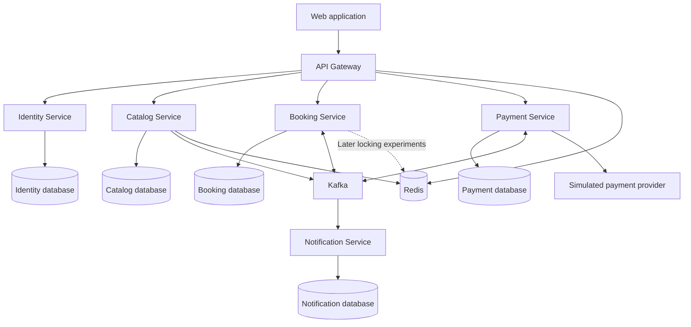

# Earlier Answers — Movie Ticket Booking Application

## Answer 1: Architecture proposal

I recommend **five business services plus an API Gateway**, built incrementally. The central design decision is to keep **show inventory, seat reservations, and bookings in one service** so that seat allocation remains a single PostgreSQL transaction.

This provides realistic microservice boundaries without making the most important correctness requirement depend on distributed transactions.

The following is an architecture proposal only. No files have been created or modified.

**1. High-level architecture**



Use a Maven monorepo initially, with independently buildable Spring Boot applications. Share dependency management and limited technical utilities; do not share JPA entities or business repositories.

Use Java 17 and Spring Boot 3.x as requested. At implementation time, select a compatible Spring Cloud release train and pin dependencies through BOMs.

**2–5. Services, responsibilities, database ownership, and entities**

| Service | Responsibilities | Owned database and important entities |
|---|---|---|
| **Identity** | Registration, login, credentials, roles, access tokens, refresh-token lifecycle | `identity_db`: User, Role, UserRole, RefreshToken |
| **Catalog** | Movies, cities, theatres, screens, physical seat layouts | `catalog_db`: Movie, City, Theatre, Screen, Seat |
| **Booking** | Shows, show-specific prices and inventory, availability, holds, booking confirmation, cancellation, booking saga | `booking_db`: Show, ShowSeat, Reservation, ReservationSeat, Booking, BookingSeat, IdempotencyRecord, SagaInstance, OutboxEvent, ProcessedEvent |
| **Payment** | Payment attempts, provider integration, payment status, refunds | `payment_db`: Payment, PaymentAttempt, Refund, OutboxEvent, ProcessedEvent |
| **Notification** | Confirmation/cancellation notifications and delivery retries | `notification_db`: Notification, DeliveryAttempt, ProcessedEvent |
| **API Gateway** | Routing and edge concerns | No business database |

Useful distinctions:

- **Seat** describes a physical seat in a screen.
- **ShowSeat** describes that seat’s inventory and price for a particular show.
- **Reservation** is a temporary hold.
- **Booking** records the purchase lifecycle.
- **Payment** records the money movement independently.

Each service accesses only its own database. Cross-service references use IDs and snapshots, without cross-database foreign keys.

For local development, one PostgreSQL instance can contain five databases with separate credentials. This preserves ownership while keeping infrastructure manageable.

**Show ownership:** Booking owns shows because scheduling, show-seat generation, prices, and allocation belong closely together. When publishing a show, it obtains the movie and screen layout from Catalog and stores the necessary snapshot. Subsequent layout edits must not silently change existing show inventory.

Do not create separate Movie, Theatre, Screen, Seat, Reservation, and Booking microservices initially.

**6. Synchronous REST communication**

Use REST when the caller needs an immediate result.

| Interaction | Reason |
|---|---|
| Client → Identity | Register, log in, refresh credentials |
| Client → Catalog | Browse movies, cities, theatres |
| Client → Booking | Browse shows, read availability, reserve seats, create/read/cancel bookings |
| Booking → Catalog | Validate movie/screen and retrieve layout when publishing a show |
| Client → Payment | Retrieve authorized payment status when needed |
| Payment → simulated provider | Initiate payment, query uncertain outcomes, request refunds |

The booking path should not call Identity or Catalog for every seat reservation. JWT verification and existing show snapshots avoid unnecessary dependencies.

Introduce Resilience4j timeouts and circuit breakers for outbound REST dependencies. Retry reads and explicitly idempotent operations; never blindly retry payment creation.

**7. Asynchronous Kafka communication**

Use Kafka for durable workflows and reactions that can finish after the initial HTTP response:

- Request payment after booking creation.
- Process payment results.
- Request and process refunds.
- Publish booking confirmation and cancellation.
- Deliver notifications.
- Invalidate selected catalog caches later.

The booking API can return `202 Accepted` with a booking ID and status URL while payment is pending. The UI initially polls that URL; WebSockets can wait.

**8. Topics and events**

Start with a small topic set:

| Topic | Example messages | Partition key |
|---|---|---|
| `payment.commands.v1` | `PaymentRequested`, `RefundRequested` | `bookingId` |
| `payment.events.v1` | `PaymentSucceeded`, `PaymentFailed`, `RefundSucceeded`, `RefundFailed` | `bookingId` |
| `booking.events.v1` | `BookingConfirmed`, `BookingCancelled`, `BookingExpired` | `bookingId` |
| `catalog.events.v1` — later | `MovieUpdated`, `ScreenLayoutChanged` | Aggregate ID |

Every message includes an event ID, schema version, aggregate ID, timestamp, correlation ID, and causation ID. Include aggregate versions where consumers need to detect stale updates.

Keying by booking ID supports ordering within a partition. It does not create ordering across topics.

Use:

- One consumer group per consuming application.
- Replicas of that application in the same group.
- A small initial partition count, increased for a demonstrated throughput need.
- Bounded retries and corresponding dead-letter topics.
- Alerts and a controlled replay process for dead-letter messages.

Retry topics can change processing order, so consumers must enforce valid state transitions.

Assume **at-least-once delivery**. Kafka’s transaction guarantees do not automatically make a PostgreSQL update or external payment exactly once. [Apache Kafka delivery semantics](https://kafka.apache.org/40/design/design/)

**9. Redis use cases**

Introduce Redis after database correctness is established:

1. Cache movie and theatre browsing with TTLs.
2. Support gateway rate limiting.
3. Experiment with distributed seat locks.
4. Optionally cache approximate availability for display.

Authoritative seat allocation always goes through PostgreSQL. Cached availability may be stale and must never authorize a booking.

Store reservation expiry durably in PostgreSQL. Redis expiration events are insufficient as the only mechanism for releasing seats.

**10. API Gateway responsibilities**

Use Spring Cloud Gateway for:

- Routing.
- JWT validation at the edge.
- CORS.
- Rate limiting.
- Request-size limits and timeouts.
- Correlation ID propagation.
- Consistent edge error responses.

Keep booking logic, payment orchestration, and database access inside the business services. Spring Cloud Gateway provides routing and cross-cutting gateway features; select its version compatible with the chosen Boot 3.x baseline. [Spring Cloud Gateway](https://docs.spring.io/spring-cloud-gateway/reference/)

**11. Authentication and authorization**

For the learning project:

- Identity authenticates users through Spring Security.
- Store passwords with an adaptive password encoder.
- Issue short-lived, asymmetrically signed JWT access tokens.
- Publish public verification keys through JWKS.
- Use rotated refresh tokens, stored as hashes with revocation state.
- Validate JWT signature, issuer, audience, and expiry in every business service.

Suggested roles:

- `CUSTOMER`: reserve seats and manage their own bookings.
- `ADMIN`: manage catalog and shows.

Roles alone are insufficient: Booking must verify that the authenticated user owns the reservation or booking. Derive user identity from the validated token rather than trusting a request-body user ID.

For a browser client, use secure, HttpOnly refresh cookies with an explicit CSRF strategy. Keep access tokens short-lived.

Later compare the custom Identity service with an established OpenID Connect provider. That is a useful architectural alternative, not an additional initial dependency.

**12. Seat booking concurrency design**

The invariant is:

> For each `(showId, seatId)`, at most one active reservation or confirmed booking may own the seat.

Start with **PostgreSQL pessimistic row locking**.

A reservation transaction:

1. Validate the requested seats and show.
2. Lock the corresponding `ShowSeat` rows in a consistent seat-ID order.
3. Check availability and existing hold expiry using database time.
4. If any requested seat is unavailable, roll back the entire request.
5. Create the reservation and assign all seats to it.
6. Commit, releasing the database locks.

PostgreSQL holds conflicting row locks until the transaction ends. After waiting, a competing transaction must inspect the current seat state before deciding whether it can proceed. [PostgreSQL explicit locking](https://www.postgresql.org/docs/17/explicit-locking.html)

Recommended initial rules:

- Five-minute hold, configurable.
- All-or-nothing multi-seat reservation.
- Bounded lock wait.
- `409 Conflict` when seats are no longer available.
- No network calls while holding seat locks.
- A unique constraint on `(show_id, seat_id)`.
- Explicit reservation ownership checks on confirmation and release.
- A database-backed expiry worker using the same locking rules.

If two users compete while a hold or booking is active, only one acquires ownership. After a hold expires or a booking is cancelled, the seat may legitimately become available again.

We should compare these alternatives through separate implementations and concurrency tests:

| Approach | Strength | Main tradeoff |
|---|---|---|
| Pessimistic locking | Clear all-or-nothing behavior under contention | Blocking, deadlocks, lock-wait management |
| Optimistic locking with `@Version` | Useful when conflicts are uncommon | Conflicting transactions fail and need careful retry handling |
| Conditional database updates | Efficient atomic state transitions | More explicit SQL and multi-seat rollback handling |
| Redis distributed locks | Coordinates application instances before database access | Lease expiry, pauses, failover, and ownership complexity |

A Redis lock must use an ownership token, bounded lease, and ownership-checked release. Lease expiration can allow another process to enter while the original process continues. Database conditional writes or version checks must therefore remain the correctness boundary. Redis documents the timing and failure assumptions behind distributed locking. [Redis distributed locks](https://redis.io/docs/latest/develop/clients/patterns/distributed-locks/)

This lets us learn distributed locking without making double-booking prevention depend solely on Redis.

**13. Transaction management**

Use short, service-local Spring `@Transactional` boundaries.

For Booking, one transaction can update:

- Booking/reservation state.
- All affected show seats.
- Idempotency outcome.
- Saga state where necessary.
- Outbox events.

For Payment, one transaction can update payment state and its outbox.

Start with PostgreSQL `READ COMMITTED` plus explicit locking or conditional updates. Higher isolation is an alternative to study, with its retry implications.

Additional rules:

- No distributed ACID transaction across services.
- No external provider call inside a database transaction.
- Translate expected conflicts into clear API responses.
- Define checked-exception rollback behavior deliberately.
- Store money as `BigDecimal` with currency.
- Use UTC instants for expiry.
- Use unique constraints as final safeguards.

For booking creation, persist an idempotency key scoped to user and operation, together with a request hash and result. Repeated identical requests return the recorded result; reuse with a different payload is rejected.

**14. Saga and transactional outbox**

Use a **Booking-orchestrated saga** when introducing Payment.

A successful flow:

1. Reserve seats.
2. Create a pending booking from the valid reservation.
3. Atomically move its seats into payment-pending ownership and write `PaymentRequested` to the outbox.
4. Payment processes the command idempotently.
5. Payment publishes its outcome through its outbox.
6. Booking consumes success, confirms seats and booking, and writes `BookingConfirmed`.
7. Notification sends confirmation.

Define a bounded payment-pending deadline distinct from the original hold expiry.

Failure handling:

- Definitive payment failure → release seats and fail the booking.
- Unknown payment outcome → reconcile with the provider using a stable payment idempotency key.
- Deadline exceeded → expire the booking according to policy.
- Success arriving after seats were released → request a refund; never take seats from a newer owner.
- Cancellation → release seats and initiate refund when applicable.
- Refund failure → remain in a visible refund-pending state for retries or intervention.

Compensation is another business action, not a rollback of history.

For the outbox, save domain changes and the event in the same local transaction. Begin with a polling publisher; defer CDC/Debezium. A crash after publishing but before marking the event sent may produce duplicates.

Consumers insert a unique processed-event record in the same transaction as their business update, then acknowledge Kafka after commit. External provider and notification effects need their own idempotency or delivery strategy.

**15. Testing strategy**

| Layer | What to verify |
|---|---|
| JUnit 5 unit tests | State transitions, expiry rules, pricing, cancellation policy |
| Mockito tests | Business orchestration and dependency failure handling |
| REST/security tests | Validation, error contracts, ownership, authentication and roles |
| PostgreSQL Testcontainers tests | Constraints, JPA behavior, real locking and rollback |
| Kafka integration tests | Outbox publication, duplicate events, retries, consumer recovery |
| Redis integration tests | Cache behavior and lock ownership/expiry |
| End-to-end tests | Reserve → pay → confirm; failure → release; cancel → refund |

The key concurrency test uses separate transactions/connections and synchronized competing requests for the same seat. Assert:

- Exactly one successful reservation.
- Exactly one active owner in the database.
- Losing requests leave no partial holds.

Also test overlapping multi-seat requests, expiry versus confirmation, duplicate payment results, late success, and crashes around outbox publishing.

Do not use H2 to prove PostgreSQL locking behavior.

**16. Podman/Docker strategy**

Create compatible container images and a Compose-based local environment incrementally.

- Begin with PostgreSQL.
- Add Kafka in KRaft mode when events are introduced.
- Add Redis when caching or locking is implemented.
- Add Prometheus and Grafana later.
- Use multi-stage image builds, non-root runtime users, health checks, and persistent database volumes.
- Keep credentials outside images and source control.

A single local Kafka broker is sufficient initially. It demonstrates messaging behavior, not production broker fault tolerance.

Testcontainers will need a compatible container runtime connection; verify Podman support on the development machine when we reach that phase.

**17. Kubernetes deployment architecture**

Introduce Kubernetes after the application works locally.

Use a local cluster such as kind or minikube, with:

- Deployments for stateless services and Gateway.
- ClusterIP Services for internal communication.
- An Ingress exposing Gateway.
- ConfigMaps and Secrets.
- Readiness, liveness, and startup probes.
- Resource requests and limits.
- Graceful shutdown.
- Migration jobs or a controlled migration step.

Run at least two Booking replicas to demonstrate concurrency correctness across instances.

For learning, stateful infrastructure can run in the cluster using persistent volumes and suitable operators/charts. A real production deployment would separately evaluate managed PostgreSQL, Kafka, and Redis.

Kubernetes DNS is sufficient for service discovery; do not add Eureka initially. Defer service meshes and multi-region deployment.

**18. Observability strategy**

Introduce observability alongside behavior:

- Spring Boot Actuator.
- Structured JSON logs.
- Correlation IDs and propagated trace context.
- Micrometer metrics and tracing.
- Prometheus collection.
- Grafana dashboards.
- A trace backend later.

Track business and technical signals:

- Reservation success/conflict rates.
- Seat-lock wait and timeout rates.
- Hold expiry-worker lag.
- Pending saga age.
- Payment failures and uncertain outcomes.
- Outbox backlog and oldest event age.
- Kafka consumer lag, retry counts, and dead-letter counts.
- Database pool utilization and API latency.

Do not use booking IDs or user IDs as metric labels; place them in logs and traces. Exclude passwords, tokens, and payment-sensitive data from logs.

**19. Recommended implementation phases**

| Phase | Deliverable and learning focus |
|---|---|
| **1. Booking foundation** | One runnable Booking service, PostgreSQL, migrations, seeded show inventory, validation, exception handling, REST contracts |
| **2. Seat concurrency** | Reservations, expiry, pessimistic locking, multi-seat atomicity, real PostgreSQL concurrency tests |
| **3. Alternative concurrency strategies** | Optimistic locking and conditional updates compared against the same invariants |
| **4. Catalog** | Movies, cities, theatres, screens, layouts; pagination, indexing, N+1 diagnosis and query design |
| **5. Identity and Gateway** | Registration/login, JWT, roles, ownership enforcement, routed APIs |
| **6. Booking lifecycle** | Booking creation, durable idempotency, cancellation rules, minimal browser UI |
| **7. Payment and Kafka** | Simulated provider, outbox, consumer deduplication, orchestrated saga |
| **8. Failure recovery** | Retries, dead-letter handling, reconciliation, refunds, late events, Resilience4j |
| **9. Notifications** | Event-driven delivery, delivery attempts, duplicate handling |
| **10. Redis** | Catalog caching, rate limiting, distributed-lock experiments |
| **11. Operational visibility** | Dashboards, tracing, fault injection, performance measurements |
| **12. Deployment and CI/CD** | Complete container environment, automated checks, Kubernetes, multiple replicas |

Actuator, useful logs, tests, and migrations start early; phase 11 deepens their operational use.

Senior-level interview discussions should accompany these phases, especially:

- Why keep inventory and booking in one service?
- What does `@Transactional` guarantee, and where does it stop?
- How do isolation, row locks, and optimistic versions differ?
- Why is checking availability before updating insufficient?
- What happens when a Redis lock lease expires during work?
- How do you prevent duplicate charges after an HTTP timeout?
- Why can an outbox publish the same event twice?
- How do consumer groups and partition keys affect ordering?
- How does a saga handle late payment success?
- How do you detect N+1 queries and choose indexes from query patterns?

For each approved implementation, I’ll follow your requested sequence: requirement, design, concepts, rationale, alternatives, interview questions, implementation, appropriate tests, and explanation of important code, while limiting changes to the agreed scope.

This proposal stops at architecture and awaits your approval.

## Answer 2: Catalog Service Movie implementation

Implemented Movie functionality in [catalog-service](/C:/Mahesh/Java/bookmyshowapp/catalog-service/README.md). All changes are confined to that directory.

**Verification:** 13 service and MVC tests passed, and executable-JAR packaging succeeded. PostgreSQL integration tests were attempted but could not start because no Docker-compatible container engine is running. Podman is installed, but has no configured machine. Database behavior therefore remains unverified on this computer.

**Complete source structure** — excluding generated `target` output:

```text
catalog-service/
├── .gitignore
├── pom.xml
├── README.md
└── src/
    ├── main/
    │   ├── java/com/bookmyshow/catalog/
    │   │   ├── CatalogServiceApplication.java
    │   │   ├── exception/
    │   │   │   ├── GlobalExceptionHandler.java
    │   │   │   └── ResourceNotFoundException.java
    │   │   └── movie/
    │   │       ├── Movie.java
    │   │       ├── MovieController.java
    │   │       ├── MovieRepository.java
    │   │       ├── MovieService.java
    │   │       └── dto/
    │   │           ├── MovieRequest.java
    │   │           ├── MovieResponse.java
    │   │           └── MoviePageResponse.java
    │   └── resources/
    │       ├── application.yml
    │       └── db/migration/
    │           └── V1__create_movies.sql
    └── test/java/com/bookmyshow/catalog/movie/
        ├── MovieServiceTest.java
        ├── MovieControllerTest.java
        └── MovieApiIT.java
```

The Maven project uses Spring Boot 3.5.16 and Java 17. This Boot release supports Java 17. [Official system requirements](https://docs.spring.io/spring-boot/3.5/system-requirements.html)

| Dependency | Purpose |
|---|---|
| Spring Web | REST controllers, Jackson JSON conversion, embedded Tomcat |
| Spring Data JPA | Repository abstraction, Hibernate, persistence integration |
| PostgreSQL driver | JDBC communication with PostgreSQL |
| Bean Validation | Request constraints such as `@NotBlank` and `@Positive` |
| Lombok | Entity getters and protected no-argument constructor |
| Flyway core/PostgreSQL module | Versioned schema migrations |
| Spring Boot Test | JUnit 5, Mockito, AssertJ, MockMvc |
| Testcontainers | Isolated PostgreSQL integration tests |

**Implemented API behavior**

| API | Behavior |
|---|---|
| `POST /api/v1/movies` | Creates a movie; returns 201 and `Location` |
| `GET /api/v1/movies/{id}` | Returns a movie or 404 |
| `GET /api/v1/movies?page=0&size=20` | Returns paginated movies |
| `PUT /api/v1/movies/{id}` | Replaces editable fields or returns 404 |
| `DELETE /api/v1/movies/{id}` | Physically deletes; returns 204 or 404 |

Pagination is zero-based, limits size to 1–100, and sorts by ID ascending. Its response contains `content`, `page`, `size`, `totalElements`, and `totalPages`.

Movie contains all requested fields. Titles may repeat, future release dates are permitted, and `active` is an editable flag. IDs and timestamps are server-managed.

Entity and DTO separation prevents the HTTP contract from exposing persistence objects or accepting client-supplied audit values. DTOs are Java records; the entity uses Lombok selectively rather than `@Data`.

**POST request flow**

For `POST /api/v1/movies`:

1. Tomcat receives the HTTP request. Spring MVC’s `DispatcherServlet` selects `MovieController.create`.
2. Jackson converts JSON into `MovieRequest`.
3. Bean Validation checks required values, lengths, and positive duration. Invalid requests return 400 before calling the service.
4. The controller invokes the Spring-managed `MovieService` proxy.
5. The transaction interceptor starts a transaction and associates an `EntityManager` with the current thread.
6. The service constructs a Movie and calls `repository.save(movie)`.
7. Spring Data detects the null ID and delegates to `EntityManager.persist`.
8. Hibernate invokes `@PrePersist`, sets timestamps, generates SQL, and binds JDBC parameters.
9. PostgreSQL validates constraints and inserts the row. Hibernate obtains the generated ID.
10. The service maps Movie to `MovieResponse`. The transaction commits before the controller receives that result.
11. The controller returns 201 with the response and resource URL.

Because ID generation uses `IDENTITY`, Hibernate normally executes the insert during persistence to obtain the ID. A sequence generator is a reasonable alternative when insert batching matters.

**How dependency injection works**

`CatalogServiceApplication` sits above the feature packages. Its `@SpringBootApplication` enables component scanning and Boot auto-configuration.

Spring discovers:

- `MovieController` through `@RestController`.
- `MovieService` through `@Service`.
- `MovieRepository` through JPA repository infrastructure.

Spring supplies the repository through the service constructor, then supplies the service through the controller constructor. A single constructor requires no `@Autowired`.

These objects are singleton beans by default. Request-specific data remains in method-local variables.

**How the repository implementation appears**

`MovieRepository` extends `JpaRepository<Movie, Long>`.

Spring Data registers a factory-created proxy implementing that interface. Inherited operations delegate to `SimpleJpaRepository`, backed by an `EntityManager`. Hibernate implements that persistence abstraction.

No handwritten repository implementation is needed. Spring Data also supplies transaction participation and persistence-exception translation. [Spring Data JPA](https://spring.io/projects/spring-data-jpa/)

**Transactions and Hibernate behavior**

Write operations have service-level `@Transactional`; reads inherit `@Transactional(readOnly = true)`. Controllers do not own database transactions.

For PUT, the service loads a managed Movie and changes its fields. Hibernate dirty checking detects changes and produces an UPDATE. Explicit `flush()` triggers the update callback before mapping `updatedAt`.

Flush sends SQL; **commit completes the transaction**. Flushed changes can still roll back.

Important limits:

- `readOnly` is an optimization hint.
- Self-invocation bypasses ordinary Spring transaction proxies.
- An unchanged PUT may leave `updatedAt` unchanged.
- Current updates use last-writer-wins semantics; optimistic versioning is deferred.

**Validation, errors, and schema management**

Request validation produces 400 Problem Details with field errors. Missing movies produce 404; database integrity conflicts produce 409 without exposing SQL.

Flyway creates the table, required columns, identity primary key, and positive-duration constraint. Hibernate uses `ddl-auto: validate`, so it verifies rather than changes the schema.

Applied migrations should remain immutable; later changes receive new migration versions.

PostgreSQL connection settings come from `DB_URL`, `DB_USERNAME`, and required `DB_PASSWORD`. Open Session in View is disabled, and timestamps use UTC.

**What the tests prove**

`MovieServiceTest` contains eight tests. Mockito mocks **only `MovieRepository`**; the service, DTOs, and Movie objects are real. Tests verify mapping, missing-resource handling, pagination, updates, and deletion. They do not verify SQL, transactions, or Hibernate callbacks.

`MovieControllerTest` contains five MVC tests. The service is mocked; Jackson, validation, HTTP dispatch, and exception handling are real. Tests cover invalid fields, pagination, IDs, malformed JSON, and 404 responses.

`MovieApiIT` uses real PostgreSQL through Testcontainers, without mocked services or repositories. It checks CRUD, persisted fields, audit timestamps, pagination, Flyway history, and database constraints. These tests need a working container engine before their assertions can run.

From `catalog-service`:

```powershell
mvn test
mvn -Pintegration verify
```

Database setup, application startup commands, request examples, alternatives, and expanded explanations are in [README.md](/C:/Mahesh/Java/bookmyshowapp/catalog-service/README.md).

**Ten related senior interview questions**

1. How do component scanning and Spring Boot auto-configuration differ?
2. Why prefer constructor injection over field injection?
3. How does Spring Data create a bean from a repository interface?
4. When does `save()` use `persist()` versus `merge()`?
5. How does Hibernate’s persistence context enable dirty checking?
6. How do flush and commit differ, and how does `IDENTITY` affect batching?
7. Why does `@Transactional` fail on self-invocation, and what triggers rollback by default?
8. What does `readOnly = true` mean, and why disable Open Session in View?
9. Why retain database constraints when DTO validation already exists?
10. Which failures require real PostgreSQL integration tests rather than Mockito tests?

Movie functionality is implemented. I’ll wait for your approval before adding the next functionality.

## Answer 3: Theater, Screen, and Show implementation (2026-09-19)

Extended catalog-service using its existing feature packages, Java record DTOs, Lombok getters/protected JPA constructors, timestamp callbacks, constructor injection, service transactions, Problem Details advice, Flyway, and PostgreSQL Testcontainers. Movie source files, its existing tests, V1, Maven configuration, and application.yml were not changed. No Booking Service or seat inventory was started.

**1. Files created/modified**

Each of these new feature packages contains seven files:

- src/main/java/com/bookmyshow/catalog/theater/: Theater.java, TheaterRepository.java, TheaterService.java, TheaterController.java, dto/TheaterRequest.java, dto/TheaterResponse.java, dto/TheaterPageResponse.java.
- src/main/java/com/bookmyshow/catalog/screen/: Screen.java, ScreenRepository.java, ScreenService.java, ScreenController.java, dto/ScreenRequest.java, dto/ScreenResponse.java, dto/ScreenPageResponse.java.
- src/main/java/com/bookmyshow/catalog/show/: Show.java, ShowRepository.java, ShowService.java, ShowController.java, dto/ShowRequest.java, dto/ShowResponse.java, dto/ShowPageResponse.java.

Other new files under catalog-service:

- src/main/java/com/bookmyshow/catalog/exception/BusinessValidationException.java.
- src/main/resources/db/migration/V2__create_theaters_screens_shows.sql.
- src/test/java/com/bookmyshow/catalog/theater/TheaterServiceTest.java.
- src/test/java/com/bookmyshow/catalog/screen/ScreenServiceTest.java.
- src/test/java/com/bookmyshow/catalog/show/ShowServiceTest.java.
- src/test/java/com/bookmyshow/catalog/CatalogControllerTest.java.
- src/test/java/com/bookmyshow/catalog/CatalogApiIT.java.

Modified catalog-service/src/main/java/com/bookmyshow/catalog/exception/GlobalExceptionHandler.java to support business validation and consistent field-error details for Spring method validation. Updated catalog-service/README.md with endpoints, examples, mappings, indexes, testing, commands, and design limits. Appended this entry to EARLIER_ANSWERS.md. Unrelated .idea changes were left untouched.

**2. Database migration**

V2 adds theaters, screens, and shows with identity primary keys, NOT NULL columns, TIMESTAMPTZ audit/show times, three foreign keys, total_seats > 0, and start_time < end_time. V1 is unchanged; Hibernate still validates instead of creating/updating the schema.

Indexes and reasons: screens(theater_id) supports the nested Screen list and Theater search join; shows(movie_id, start_time) supports Movie/date searches and Movie FK checks; shows(screen_id, start_time) supports Screen scheduling lookups, Theater searches through Screens, and Screen FK checks; shows(start_time, id) supports date-only searches and stable chronological pagination. No speculative city/name indexes were added.

**3?4. JPA relationships and ownership**

| Relationship | Owner | Why |
|---|---|---|
| Screen -> Theater | Screen | screens.theater_id is the foreign key |
| Show -> Movie | Show | shows.movie_id is the foreign key |
| Show -> Screen | Show | shows.screen_id is the foreign key |

All are required unidirectional ManyToOne relationships. Multiple child rows establish the requested one-to-many cardinalities without parent collections. Parent collections, inverse sides, OneToMany, and mappedBy are unnecessary for these APIs because repositories provide paginated child queries. If a future parent collection is needed, mappedBy should point to the child's owning property.

**5?6. Fetching and lifecycle**

All relationships explicitly use LAZY, not blanket EAGER. No cascade or orphanRemoval is enabled: Movie, Theater, Screen, and Show have separately managed lifecycles. Removing a Show must not remove its parents. Foreign keys prevent deleting a referenced parent; existing Movie DELETE now returns 409 when Shows reference the Movie.

**7?8. N+1 risk and prevention**

ShowResponse includes Movie title, Screen name, and Theater name/city. Mapping a page without a fetch plan can cause additional SQL per distinct related record. ShowRepository applies EntityGraph(movie, screen, screen.theater) to paginated search and findById. Only to-one joins are fetched, keeping SQL pagination safe; the count is separate. A real PostgreSQL test with distinct parents measured exactly two SQL statements for a full page with a count and one for a single detailed Show.

**9. Transactions**

Each new service has @Transactional(readOnly = true); create methods override with @Transactional. Reference validation, insert, and DTO mapping occur inside the service transaction. Only new entities are saved. No unnecessary save calls for loaded parents, no controller transactions, and no reliance on Open Session in View. spring.jpa.open-in-view=false remains unchanged.

**10. Tests and actual verification**

- 18 new service test cases: Theater (3), Screen (6), Show (9). Mockito checks mapping, pagination, required references, Theater mismatch, positive seats, strict time order, and UTC date bounds; it does not claim to prove SQL behavior.
- 6 new MVC tests check body/path/query validation, pagination, date parsing, and Problem Details.
- 6 new real PostgreSQL integration tests check HTTP persistence/reads, multiple Screens per Theater, persisted FK relationships, LAZY mappings, absence of parent-delete cascades, Flyway versions, PostgreSQL FK/NOT NULL/CHECK constraints, search filters and UTC date boundaries, pagination, 404/400/409 behavior, and N+1 prevention.
- All 13 existing Movie unit/MVC tests and all 4 existing Movie integration tests pass.

Final command: mvn -pl catalog-service -Pintegration verify ? BUILD SUCCESS, 37 unit/MVC tests plus 10 PostgreSQL integration tests, zero failures/errors/skips. The executable JAR was packaged successfully. Containers used postgres:17-alpine through the running Podman Docker-compatible API.

Earlier verification caught and fixed an extended-year Instant literal, Spring's method-validation error-body difference, and PostgreSQL binding an absent city to an invalid type for lower(). The city query now explicitly casts that parameter to string. The initial sandboxed integration attempt was denied named-pipe access; the approved run outside the sandbox executed the actual PostgreSQL tests. No H2 or skipped-container fallback was introduced.

**11. Commands**

From C:\Mahesh\Java\bookmyshowapp:

```powershell
mvn -pl catalog-service test
mvn -pl catalog-service -Pintegration verify

$env:DB_URL = 'jdbc:postgresql://localhost:5432/catalog_db'
$env:DB_USERNAME = 'catalog_user'
$env:DB_PASSWORD = 'choose-a-local-password'
mvn -pl catalog-service spring-boot:run
```

Application startup requires the role/database and running PostgreSQL described in catalog-service/README.md. Tests supply their own isolated database and credentials; integration tests require a running Docker-compatible engine and API access. Default application port remains 8081.

**12. API and decisions before the next phase**

POST/GET /api/v1/theaters; GET /api/v1/theaters/{id}; POST/GET /api/v1/theaters/{theaterId}/screens; GET /api/v1/screens/{id}; POST/GET /api/v1/shows; GET /api/v1/shows/{id}. POST returns 201 with a resource Location. All lists are paginated, page is zero-based, and size is 1?100.

Show search optionally combines movieId, theaterId, city, and date. City is a case-insensitive exact match; date means the UTC day containing startTime, using an inclusive lower/exclusive upper bound. Show order is startTime then ID; Theater/Screen order is ID. Missing search matches produce an empty page; a missing Theater on the nested Screen route is 404.

ShowRequest requires movieId, screenId, and expected theaterId. Only Screen's Theater relationship is persisted; theaterId is not duplicated on shows. Times require an offset or Z, normalize to UTC, and are restricted to years 0001?9999. A future cinema-local date API needs an explicit time-zone model.

active remains descriptive, and lists include inactive records. Inactive parents, duplicate names, and overlapping Shows are currently permitted. End time is explicit, not computed from Movie duration. totalSeats is capacity metadata, not bookable inventory. No new update/delete endpoints, ShowSeat, seat booking, locking, concurrency, messaging, caching, security, payment, notification, gateway, or Kubernetes were added.

The pre-existing Movie language endpoint returns Movie entities and was preserved under the instruction not to rewrite existing Movie functionality; all newly added endpoints return DTOs. Full examples and explanations are in [catalog-service/README.md](catalog-service/README.md).

## Development profile support (2026-09-19)

Created catalog-service/src/main/resources/application-dev.yml. It sets the local datasource URL to jdbc:postgresql://[::1]:5432/catalog_db, username catalog_user, and password catalog_password. It enables DEBUG for com.bookmyshow.catalog and org.hibernate.SQL, TRACE for org.hibernate.orm.jdbc.bind, and Hibernate format_sql. Logging is scoped to dev; no broad Spring DEBUG setting was added.

Modified catalog-service/pom.xml to add spring-boot-devtools with runtime scope and optional=true. Spring Boot's existing Maven repackage configuration excludes DevTools by default; inspection of the generated executable JAR confirmed that no DevTools JAR was included. Automatic restart watches compiled classpath changes: compile using the IDE or mvn compile while spring-boot:run is running.

application.yml was inspected and left unchanged. Common settings remain Flyway enabled, ddl-auto=validate, open-in-view=false, UTC JDBC handling, application/server configuration, and the existing environment-variable datasource defaults. No global active profile was added. No business classes, migrations, tests, or application structure were changed.

Modified catalog-service/README.md to document local startup, logging, restart behavior, and the distinction between default environment-based credentials and the explicit local dev credentials. This history entry is the fourth file created/modified for this task. Unrelated .idea changes were left untouched.

From catalog-service in PowerShell:

```powershell
mvn spring-boot:run "-Dspring-boot.run.profiles=dev"
```

Verification: mvn -pl catalog-service -Pintegration verify passed 37 unit/MVC tests and 10 real PostgreSQL Testcontainers integration tests, with zero failures/errors/skips. Executable-JAR packaging passed and DevTools exclusion was verified. The first sandboxed Maven attempt was denied access to its dependency cache; the approved run outside the sandbox succeeded with Podman. Tests ran with the default profile and isolated containers; this task did not launch the application against the local catalog_db or manually exercise restart.
