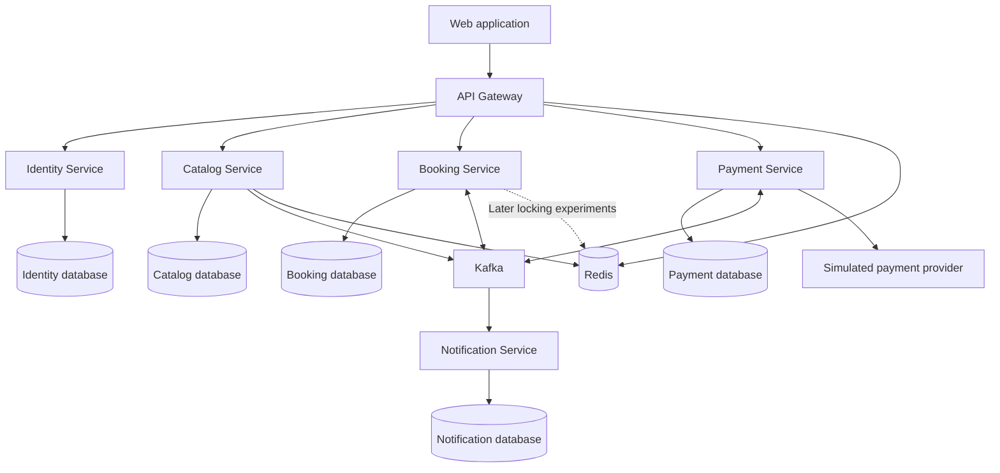

# Earlier Answers — Movie Ticket Booking Application

## Answer 1: Architecture proposal

I recommend **five business services plus an API Gateway**, built incrementally. The central design decision is to keep **show inventory, seat reservations, and bookings in one service** so that seat allocation remains a single PostgreSQL transaction.

This provides realistic microservice boundaries without making the most important correctness requirement depend on distributed transactions.

The following is an architecture proposal only. No files have been created or modified.

**1. High-level architecture**



Use a Maven monorepo initially, with independently buildable Spring Boot applications. Share dependency management and limited technical utilities; do not share JPA entities or business repositories.

Use Java 17 and Spring Boot 3.x as requested. At implementation time, select a compatible Spring Cloud release train and pin dependencies through BOMs.

**2–5. Services, responsibilities, database ownership, and entities**

| Service | Responsibilities | Owned database and important entities |
|---|---|---|
| **Identity** | Registration, login, credentials, roles, access tokens, refresh-token lifecycle | `identity_db`: User, Role, UserRole, RefreshToken |
| **Catalog** | Movies, cities, theatres, screens, physical seat layouts | `catalog_db`: Movie, City, Theatre, Screen, Seat |
| **Booking** | Shows, show-specific prices and inventory, availability, holds, booking confirmation, cancellation, booking saga | `booking_db`: Show, ShowSeat, Reservation, ReservationSeat, Booking, BookingSeat, IdempotencyRecord, SagaInstance, OutboxEvent, ProcessedEvent |
| **Payment** | Payment attempts, provider integration, payment status, refunds | `payment_db`: Payment, PaymentAttempt, Refund, OutboxEvent, ProcessedEvent |
| **Notification** | Confirmation/cancellation notifications and delivery retries | `notification_db`: Notification, DeliveryAttempt, ProcessedEvent |
| **API Gateway** | Routing and edge concerns | No business database |

Useful distinctions:

- **Seat** describes a physical seat in a screen.
- **ShowSeat** describes that seat’s inventory and price for a particular show.
- **Reservation** is a temporary hold.
- **Booking** records the purchase lifecycle.
- **Payment** records the money movement independently.

Each service accesses only its own database. Cross-service references use IDs and snapshots, without cross-database foreign keys.

For local development, one PostgreSQL instance can contain five databases with separate credentials. This preserves ownership while keeping infrastructure manageable.

**Show ownership:** Booking owns shows because scheduling, show-seat generation, prices, and allocation belong closely together. When publishing a show, it obtains the movie and screen layout from Catalog and stores the necessary snapshot. Subsequent layout edits must not silently change existing show inventory.

Do not create separate Movie, Theatre, Screen, Seat, Reservation, and Booking microservices initially.

**6. Synchronous REST communication**

Use REST when the caller needs an immediate result.

| Interaction | Reason |
|---|---|
| Client → Identity | Register, log in, refresh credentials |
| Client → Catalog | Browse movies, cities, theatres |
| Client → Booking | Browse shows, read availability, reserve seats, create/read/cancel bookings |
| Booking → Catalog | Validate movie/screen and retrieve layout when publishing a show |
| Client → Payment | Retrieve authorized payment status when needed |
| Payment → simulated provider | Initiate payment, query uncertain outcomes, request refunds |

The booking path should not call Identity or Catalog for every seat reservation. JWT verification and existing show snapshots avoid unnecessary dependencies.

Introduce Resilience4j timeouts and circuit breakers for outbound REST dependencies. Retry reads and explicitly idempotent operations; never blindly retry payment creation.

**7. Asynchronous Kafka communication**

Use Kafka for durable workflows and reactions that can finish after the initial HTTP response:

- Request payment after booking creation.
- Process payment results.
- Request and process refunds.
- Publish booking confirmation and cancellation.
- Deliver notifications.
- Invalidate selected catalog caches later.

The booking API can return `202 Accepted` with a booking ID and status URL while payment is pending. The UI initially polls that URL; WebSockets can wait.

**8. Topics and events**

Start with a small topic set:

| Topic | Example messages | Partition key |
|---|---|---|
| `payment.commands.v1` | `PaymentRequested`, `RefundRequested` | `bookingId` |
| `payment.events.v1` | `PaymentSucceeded`, `PaymentFailed`, `RefundSucceeded`, `RefundFailed` | `bookingId` |
| `booking.events.v1` | `BookingConfirmed`, `BookingCancelled`, `BookingExpired` | `bookingId` |
| `catalog.events.v1` — later | `MovieUpdated`, `ScreenLayoutChanged` | Aggregate ID |

Every message includes an event ID, schema version, aggregate ID, timestamp, correlation ID, and causation ID. Include aggregate versions where consumers need to detect stale updates.

Keying by booking ID supports ordering within a partition. It does not create ordering across topics.

Use:

- One consumer group per consuming application.
- Replicas of that application in the same group.
- A small initial partition count, increased for a demonstrated throughput need.
- Bounded retries and corresponding dead-letter topics.
- Alerts and a controlled replay process for dead-letter messages.

Retry topics can change processing order, so consumers must enforce valid state transitions.

Assume **at-least-once delivery**. Kafka’s transaction guarantees do not automatically make a PostgreSQL update or external payment exactly once. [Apache Kafka delivery semantics](https://kafka.apache.org/40/design/design/)

**9. Redis use cases**

Introduce Redis after database correctness is established:

1. Cache movie and theatre browsing with TTLs.
2. Support gateway rate limiting.
3. Experiment with distributed seat locks.
4. Optionally cache approximate availability for display.

Authoritative seat allocation always goes through PostgreSQL. Cached availability may be stale and must never authorize a booking.

Store reservation expiry durably in PostgreSQL. Redis expiration events are insufficient as the only mechanism for releasing seats.

**10. API Gateway responsibilities**

Use Spring Cloud Gateway for:

- Routing.
- JWT validation at the edge.
- CORS.
- Rate limiting.
- Request-size limits and timeouts.
- Correlation ID propagation.
- Consistent edge error responses.

Keep booking logic, payment orchestration, and database access inside the business services. Spring Cloud Gateway provides routing and cross-cutting gateway features; select its version compatible with the chosen Boot 3.x baseline. [Spring Cloud Gateway](https://docs.spring.io/spring-cloud-gateway/reference/)

**11. Authentication and authorization**

For the learning project:

- Identity authenticates users through Spring Security.
- Store passwords with an adaptive password encoder.
- Issue short-lived, asymmetrically signed JWT access tokens.
- Publish public verification keys through JWKS.
- Use rotated refresh tokens, stored as hashes with revocation state.
- Validate JWT signature, issuer, audience, and expiry in every business service.

Suggested roles:

- `CUSTOMER`: reserve seats and manage their own bookings.
- `ADMIN`: manage catalog and shows.

Roles alone are insufficient: Booking must verify that the authenticated user owns the reservation or booking. Derive user identity from the validated token rather than trusting a request-body user ID.

For a browser client, use secure, HttpOnly refresh cookies with an explicit CSRF strategy. Keep access tokens short-lived.

Later compare the custom Identity service with an established OpenID Connect provider. That is a useful architectural alternative, not an additional initial dependency.

**12. Seat booking concurrency design**

The invariant is:

> For each `(showId, seatId)`, at most one active reservation or confirmed booking may own the seat.

Start with **PostgreSQL pessimistic row locking**.

A reservation transaction:

1. Validate the requested seats and show.
2. Lock the corresponding `ShowSeat` rows in a consistent seat-ID order.
3. Check availability and existing hold expiry using database time.
4. If any requested seat is unavailable, roll back the entire request.
5. Create the reservation and assign all seats to it.
6. Commit, releasing the database locks.

PostgreSQL holds conflicting row locks until the transaction ends. After waiting, a competing transaction must inspect the current seat state before deciding whether it can proceed. [PostgreSQL explicit locking](https://www.postgresql.org/docs/17/explicit-locking.html)

Recommended initial rules:

- Five-minute hold, configurable.
- All-or-nothing multi-seat reservation.
- Bounded lock wait.
- `409 Conflict` when seats are no longer available.
- No network calls while holding seat locks.
- A unique constraint on `(show_id, seat_id)`.
- Explicit reservation ownership checks on confirmation and release.
- A database-backed expiry worker using the same locking rules.

If two users compete while a hold or booking is active, only one acquires ownership. After a hold expires or a booking is cancelled, the seat may legitimately become available again.

We should compare these alternatives through separate implementations and concurrency tests:

| Approach | Strength | Main tradeoff |
|---|---|---|
| Pessimistic locking | Clear all-or-nothing behavior under contention | Blocking, deadlocks, lock-wait management |
| Optimistic locking with `@Version` | Useful when conflicts are uncommon | Conflicting transactions fail and need careful retry handling |
| Conditional database updates | Efficient atomic state transitions | More explicit SQL and multi-seat rollback handling |
| Redis distributed locks | Coordinates application instances before database access | Lease expiry, pauses, failover, and ownership complexity |

A Redis lock must use an ownership token, bounded lease, and ownership-checked release. Lease expiration can allow another process to enter while the original process continues. Database conditional writes or version checks must therefore remain the correctness boundary. Redis documents the timing and failure assumptions behind distributed locking. [Redis distributed locks](https://redis.io/docs/latest/develop/clients/patterns/distributed-locks/)

This lets us learn distributed locking without making double-booking prevention depend solely on Redis.

**13. Transaction management**

Use short, service-local Spring `@Transactional` boundaries.

For Booking, one transaction can update:

- Booking/reservation state.
- All affected show seats.
- Idempotency outcome.
- Saga state where necessary.
- Outbox events.

For Payment, one transaction can update payment state and its outbox.

Start with PostgreSQL `READ COMMITTED` plus explicit locking or conditional updates. Higher isolation is an alternative to study, with its retry implications.

Additional rules:

- No distributed ACID transaction across services.
- No external provider call inside a database transaction.
- Translate expected conflicts into clear API responses.
- Define checked-exception rollback behavior deliberately.
- Store money as `BigDecimal` with currency.
- Use UTC instants for expiry.
- Use unique constraints as final safeguards.

For booking creation, persist an idempotency key scoped to user and operation, together with a request hash and result. Repeated identical requests return the recorded result; reuse with a different payload is rejected.

**14. Saga and transactional outbox**

Use a **Booking-orchestrated saga** when introducing Payment.

A successful flow:

1. Reserve seats.
2. Create a pending booking from the valid reservation.
3. Atomically move its seats into payment-pending ownership and write `PaymentRequested` to the outbox.
4. Payment processes the command idempotently.
5. Payment publishes its outcome through its outbox.
6. Booking consumes success, confirms seats and booking, and writes `BookingConfirmed`.
7. Notification sends confirmation.

Define a bounded payment-pending deadline distinct from the original hold expiry.

Failure handling:

- Definitive payment failure → release seats and fail the booking.
- Unknown payment outcome → reconcile with the provider using a stable payment idempotency key.
- Deadline exceeded → expire the booking according to policy.
- Success arriving after seats were released → request a refund; never take seats from a newer owner.
- Cancellation → release seats and initiate refund when applicable.
- Refund failure → remain in a visible refund-pending state for retries or intervention.

Compensation is another business action, not a rollback of history.

For the outbox, save domain changes and the event in the same local transaction. Begin with a polling publisher; defer CDC/Debezium. A crash after publishing but before marking the event sent may produce duplicates.

Consumers insert a unique processed-event record in the same transaction as their business update, then acknowledge Kafka after commit. External provider and notification effects need their own idempotency or delivery strategy.

**15. Testing strategy**

| Layer | What to verify |
|---|---|
| JUnit 5 unit tests | State transitions, expiry rules, pricing, cancellation policy |
| Mockito tests | Business orchestration and dependency failure handling |
| REST/security tests | Validation, error contracts, ownership, authentication and roles |
| PostgreSQL Testcontainers tests | Constraints, JPA behavior, real locking and rollback |
| Kafka integration tests | Outbox publication, duplicate events, retries, consumer recovery |
| Redis integration tests | Cache behavior and lock ownership/expiry |
| End-to-end tests | Reserve → pay → confirm; failure → release; cancel → refund |

The key concurrency test uses separate transactions/connections and synchronized competing requests for the same seat. Assert:

- Exactly one successful reservation.
- Exactly one active owner in the database.
- Losing requests leave no partial holds.

Also test overlapping multi-seat requests, expiry versus confirmation, duplicate payment results, late success, and crashes around outbox publishing.

Do not use H2 to prove PostgreSQL locking behavior.

**16. Podman/Docker strategy**

Create compatible container images and a Compose-based local environment incrementally.

- Begin with PostgreSQL.
- Add Kafka in KRaft mode when events are introduced.
- Add Redis when caching or locking is implemented.
- Add Prometheus and Grafana later.
- Use multi-stage image builds, non-root runtime users, health checks, and persistent database volumes.
- Keep credentials outside images and source control.

A single local Kafka broker is sufficient initially. It demonstrates messaging behavior, not production broker fault tolerance.

Testcontainers will need a compatible container runtime connection; verify Podman support on the development machine when we reach that phase.

**17. Kubernetes deployment architecture**

Introduce Kubernetes after the application works locally.

Use a local cluster such as kind or minikube, with:

- Deployments for stateless services and Gateway.
- ClusterIP Services for internal communication.
- An Ingress exposing Gateway.
- ConfigMaps and Secrets.
- Readiness, liveness, and startup probes.
- Resource requests and limits.
- Graceful shutdown.
- Migration jobs or a controlled migration step.

Run at least two Booking replicas to demonstrate concurrency correctness across instances.

For learning, stateful infrastructure can run in the cluster using persistent volumes and suitable operators/charts. A real production deployment would separately evaluate managed PostgreSQL, Kafka, and Redis.

Kubernetes DNS is sufficient for service discovery; do not add Eureka initially. Defer service meshes and multi-region deployment.

**18. Observability strategy**

Introduce observability alongside behavior:

- Spring Boot Actuator.
- Structured JSON logs.
- Correlation IDs and propagated trace context.
- Micrometer metrics and tracing.
- Prometheus collection.
- Grafana dashboards.
- A trace backend later.

Track business and technical signals:

- Reservation success/conflict rates.
- Seat-lock wait and timeout rates.
- Hold expiry-worker lag.
- Pending saga age.
- Payment failures and uncertain outcomes.
- Outbox backlog and oldest event age.
- Kafka consumer lag, retry counts, and dead-letter counts.
- Database pool utilization and API latency.

Do not use booking IDs or user IDs as metric labels; place them in logs and traces. Exclude passwords, tokens, and payment-sensitive data from logs.

**19. Recommended implementation phases**

| Phase | Deliverable and learning focus |
|---|---|
| **1. Booking foundation** | One runnable Booking service, PostgreSQL, migrations, seeded show inventory, validation, exception handling, REST contracts |
| **2. Seat concurrency** | Reservations, expiry, pessimistic locking, multi-seat atomicity, real PostgreSQL concurrency tests |
| **3. Alternative concurrency strategies** | Optimistic locking and conditional updates compared against the same invariants |
| **4. Catalog** | Movies, cities, theatres, screens, layouts; pagination, indexing, N+1 diagnosis and query design |
| **5. Identity and Gateway** | Registration/login, JWT, roles, ownership enforcement, routed APIs |
| **6. Booking lifecycle** | Booking creation, durable idempotency, cancellation rules, minimal browser UI |
| **7. Payment and Kafka** | Simulated provider, outbox, consumer deduplication, orchestrated saga |
| **8. Failure recovery** | Retries, dead-letter handling, reconciliation, refunds, late events, Resilience4j |
| **9. Notifications** | Event-driven delivery, delivery attempts, duplicate handling |
| **10. Redis** | Catalog caching, rate limiting, distributed-lock experiments |
| **11. Operational visibility** | Dashboards, tracing, fault injection, performance measurements |
| **12. Deployment and CI/CD** | Complete container environment, automated checks, Kubernetes, multiple replicas |

Actuator, useful logs, tests, and migrations start early; phase 11 deepens their operational use.

Senior-level interview discussions should accompany these phases, especially:

- Why keep inventory and booking in one service?
- What does `@Transactional` guarantee, and where does it stop?
- How do isolation, row locks, and optimistic versions differ?
- Why is checking availability before updating insufficient?
- What happens when a Redis lock lease expires during work?
- How do you prevent duplicate charges after an HTTP timeout?
- Why can an outbox publish the same event twice?
- How do consumer groups and partition keys affect ordering?
- How does a saga handle late payment success?
- How do you detect N+1 queries and choose indexes from query patterns?

For each approved implementation, I’ll follow your requested sequence: requirement, design, concepts, rationale, alternatives, interview questions, implementation, appropriate tests, and explanation of important code, while limiting changes to the agreed scope.

This proposal stops at architecture and awaits your approval.

## Answer 2: Catalog Service Movie implementation

Implemented Movie functionality in [catalog-service](/C:/Mahesh/Java/bookmyshowapp/catalog-service/README.md). All changes are confined to that directory.

**Verification:** 13 service and MVC tests passed, and executable-JAR packaging succeeded. PostgreSQL integration tests were attempted but could not start because no Docker-compatible container engine is running. Podman is installed, but has no configured machine. Database behavior therefore remains unverified on this computer.

**Complete source structure** — excluding generated `target` output:

```text
catalog-service/
├── .gitignore
├── pom.xml
├── README.md
└── src/
    ├── main/
    │   ├── java/com/bookmyshow/catalog/
    │   │   ├── CatalogServiceApplication.java
    │   │   ├── exception/
    │   │   │   ├── GlobalExceptionHandler.java
    │   │   │   └── ResourceNotFoundException.java
    │   │   └── movie/
    │   │       ├── Movie.java
    │   │       ├── MovieController.java
    │   │       ├── MovieRepository.java
    │   │       ├── MovieService.java
    │   │       └── dto/
    │   │           ├── MovieRequest.java
    │   │           ├── MovieResponse.java
    │   │           └── MoviePageResponse.java
    │   └── resources/
    │       ├── application.yml
    │       └── db/migration/
    │           └── V1__create_movies.sql
    └── test/java/com/bookmyshow/catalog/movie/
        ├── MovieServiceTest.java
        ├── MovieControllerTest.java
        └── MovieApiIT.java
```

The Maven project uses Spring Boot 3.5.16 and Java 17. This Boot release supports Java 17. [Official system requirements](https://docs.spring.io/spring-boot/3.5/system-requirements.html)

| Dependency | Purpose |
|---|---|
| Spring Web | REST controllers, Jackson JSON conversion, embedded Tomcat |
| Spring Data JPA | Repository abstraction, Hibernate, persistence integration |
| PostgreSQL driver | JDBC communication with PostgreSQL |
| Bean Validation | Request constraints such as `@NotBlank` and `@Positive` |
| Lombok | Entity getters and protected no-argument constructor |
| Flyway core/PostgreSQL module | Versioned schema migrations |
| Spring Boot Test | JUnit 5, Mockito, AssertJ, MockMvc |
| Testcontainers | Isolated PostgreSQL integration tests |

**Implemented API behavior**

| API | Behavior |
|---|---|
| `POST /api/v1/movies` | Creates a movie; returns 201 and `Location` |
| `GET /api/v1/movies/{id}` | Returns a movie or 404 |
| `GET /api/v1/movies?page=0&size=20` | Returns paginated movies |
| `PUT /api/v1/movies/{id}` | Replaces editable fields or returns 404 |
| `DELETE /api/v1/movies/{id}` | Physically deletes; returns 204 or 404 |

Pagination is zero-based, limits size to 1–100, and sorts by ID ascending. Its response contains `content`, `page`, `size`, `totalElements`, and `totalPages`.

Movie contains all requested fields. Titles may repeat, future release dates are permitted, and `active` is an editable flag. IDs and timestamps are server-managed.

Entity and DTO separation prevents the HTTP contract from exposing persistence objects or accepting client-supplied audit values. DTOs are Java records; the entity uses Lombok selectively rather than `@Data`.

**POST request flow**

For `POST /api/v1/movies`:

1. Tomcat receives the HTTP request. Spring MVC’s `DispatcherServlet` selects `MovieController.create`.
2. Jackson converts JSON into `MovieRequest`.
3. Bean Validation checks required values, lengths, and positive duration. Invalid requests return 400 before calling the service.
4. The controller invokes the Spring-managed `MovieService` proxy.
5. The transaction interceptor starts a transaction and associates an `EntityManager` with the current thread.
6. The service constructs a Movie and calls `repository.save(movie)`.
7. Spring Data detects the null ID and delegates to `EntityManager.persist`.
8. Hibernate invokes `@PrePersist`, sets timestamps, generates SQL, and binds JDBC parameters.
9. PostgreSQL validates constraints and inserts the row. Hibernate obtains the generated ID.
10. The service maps Movie to `MovieResponse`. The transaction commits before the controller receives that result.
11. The controller returns 201 with the response and resource URL.

Because ID generation uses `IDENTITY`, Hibernate normally executes the insert during persistence to obtain the ID. A sequence generator is a reasonable alternative when insert batching matters.

**How dependency injection works**

`CatalogServiceApplication` sits above the feature packages. Its `@SpringBootApplication` enables component scanning and Boot auto-configuration.

Spring discovers:

- `MovieController` through `@RestController`.
- `MovieService` through `@Service`.
- `MovieRepository` through JPA repository infrastructure.

Spring supplies the repository through the service constructor, then supplies the service through the controller constructor. A single constructor requires no `@Autowired`.

These objects are singleton beans by default. Request-specific data remains in method-local variables.

**How the repository implementation appears**

`MovieRepository` extends `JpaRepository<Movie, Long>`.

Spring Data registers a factory-created proxy implementing that interface. Inherited operations delegate to `SimpleJpaRepository`, backed by an `EntityManager`. Hibernate implements that persistence abstraction.

No handwritten repository implementation is needed. Spring Data also supplies transaction participation and persistence-exception translation. [Spring Data JPA](https://spring.io/projects/spring-data-jpa/)

**Transactions and Hibernate behavior**

Write operations have service-level `@Transactional`; reads inherit `@Transactional(readOnly = true)`. Controllers do not own database transactions.

For PUT, the service loads a managed Movie and changes its fields. Hibernate dirty checking detects changes and produces an UPDATE. Explicit `flush()` triggers the update callback before mapping `updatedAt`.

Flush sends SQL; **commit completes the transaction**. Flushed changes can still roll back.

Important limits:

- `readOnly` is an optimization hint.
- Self-invocation bypasses ordinary Spring transaction proxies.
- An unchanged PUT may leave `updatedAt` unchanged.
- Current updates use last-writer-wins semantics; optimistic versioning is deferred.

**Validation, errors, and schema management**

Request validation produces 400 Problem Details with field errors. Missing movies produce 404; database integrity conflicts produce 409 without exposing SQL.

Flyway creates the table, required columns, identity primary key, and positive-duration constraint. Hibernate uses `ddl-auto: validate`, so it verifies rather than changes the schema.

Applied migrations should remain immutable; later changes receive new migration versions.

PostgreSQL connection settings come from `DB_URL`, `DB_USERNAME`, and required `DB_PASSWORD`. Open Session in View is disabled, and timestamps use UTC.

**What the tests prove**

`MovieServiceTest` contains eight tests. Mockito mocks **only `MovieRepository`**; the service, DTOs, and Movie objects are real. Tests verify mapping, missing-resource handling, pagination, updates, and deletion. They do not verify SQL, transactions, or Hibernate callbacks.

`MovieControllerTest` contains five MVC tests. The service is mocked; Jackson, validation, HTTP dispatch, and exception handling are real. Tests cover invalid fields, pagination, IDs, malformed JSON, and 404 responses.

`MovieApiIT` uses real PostgreSQL through Testcontainers, without mocked services or repositories. It checks CRUD, persisted fields, audit timestamps, pagination, Flyway history, and database constraints. These tests need a working container engine before their assertions can run.

From `catalog-service`:

```powershell
mvn test
mvn -Pintegration verify
```

Database setup, application startup commands, request examples, alternatives, and expanded explanations are in [README.md](/C:/Mahesh/Java/bookmyshowapp/catalog-service/README.md).

**Ten related senior interview questions**

1. How do component scanning and Spring Boot auto-configuration differ?
2. Why prefer constructor injection over field injection?
3. How does Spring Data create a bean from a repository interface?
4. When does `save()` use `persist()` versus `merge()`?
5. How does Hibernate’s persistence context enable dirty checking?
6. How do flush and commit differ, and how does `IDENTITY` affect batching?
7. Why does `@Transactional` fail on self-invocation, and what triggers rollback by default?
8. What does `readOnly = true` mean, and why disable Open Session in View?
9. Why retain database constraints when DTO validation already exists?
10. Which failures require real PostgreSQL integration tests rather than Mockito tests?

Movie functionality is implemented. I’ll wait for your approval before adding the next functionality.

## Answer 3: Theater, Screen, and Show implementation (2026-09-19)

Extended catalog-service using its existing feature packages, Java record DTOs, Lombok getters/protected JPA constructors, timestamp callbacks, constructor injection, service transactions, Problem Details advice, Flyway, and PostgreSQL Testcontainers. Movie source files, its existing tests, V1, Maven configuration, and application.yml were not changed. No Booking Service or seat inventory was started.

**1. Files created/modified**

Each of these new feature packages contains seven files:

- src/main/java/com/bookmyshow/catalog/theater/: Theater.java, TheaterRepository.java, TheaterService.java, TheaterController.java, dto/TheaterRequest.java, dto/TheaterResponse.java, dto/TheaterPageResponse.java.
- src/main/java/com/bookmyshow/catalog/screen/: Screen.java, ScreenRepository.java, ScreenService.java, ScreenController.java, dto/ScreenRequest.java, dto/ScreenResponse.java, dto/ScreenPageResponse.java.
- src/main/java/com/bookmyshow/catalog/show/: Show.java, ShowRepository.java, ShowService.java, ShowController.java, dto/ShowRequest.java, dto/ShowResponse.java, dto/ShowPageResponse.java.

Other new files under catalog-service:

- src/main/java/com/bookmyshow/catalog/exception/BusinessValidationException.java.
- src/main/resources/db/migration/V2__create_theaters_screens_shows.sql.
- src/test/java/com/bookmyshow/catalog/theater/TheaterServiceTest.java.
- src/test/java/com/bookmyshow/catalog/screen/ScreenServiceTest.java.
- src/test/java/com/bookmyshow/catalog/show/ShowServiceTest.java.
- src/test/java/com/bookmyshow/catalog/CatalogControllerTest.java.
- src/test/java/com/bookmyshow/catalog/CatalogApiIT.java.

Modified catalog-service/src/main/java/com/bookmyshow/catalog/exception/GlobalExceptionHandler.java to support business validation and consistent field-error details for Spring method validation. Updated catalog-service/README.md with endpoints, examples, mappings, indexes, testing, commands, and design limits. Appended this entry to EARLIER_ANSWERS.md. Unrelated .idea changes were left untouched.

**2. Database migration**

V2 adds theaters, screens, and shows with identity primary keys, NOT NULL columns, TIMESTAMPTZ audit/show times, three foreign keys, total_seats > 0, and start_time < end_time. V1 is unchanged; Hibernate still validates instead of creating/updating the schema.

Indexes and reasons: screens(theater_id) supports the nested Screen list and Theater search join; shows(movie_id, start_time) supports Movie/date searches and Movie FK checks; shows(screen_id, start_time) supports Screen scheduling lookups, Theater searches through Screens, and Screen FK checks; shows(start_time, id) supports date-only searches and stable chronological pagination. No speculative city/name indexes were added.

**3?4. JPA relationships and ownership**

| Relationship | Owner | Why |
|---|---|---|
| Screen -> Theater | Screen | screens.theater_id is the foreign key |
| Show -> Movie | Show | shows.movie_id is the foreign key |
| Show -> Screen | Show | shows.screen_id is the foreign key |

All are required unidirectional ManyToOne relationships. Multiple child rows establish the requested one-to-many cardinalities without parent collections. Parent collections, inverse sides, OneToMany, and mappedBy are unnecessary for these APIs because repositories provide paginated child queries. If a future parent collection is needed, mappedBy should point to the child's owning property.

**5?6. Fetching and lifecycle**

All relationships explicitly use LAZY, not blanket EAGER. No cascade or orphanRemoval is enabled: Movie, Theater, Screen, and Show have separately managed lifecycles. Removing a Show must not remove its parents. Foreign keys prevent deleting a referenced parent; existing Movie DELETE now returns 409 when Shows reference the Movie.

**7?8. N+1 risk and prevention**

ShowResponse includes Movie title, Screen name, and Theater name/city. Mapping a page without a fetch plan can cause additional SQL per distinct related record. ShowRepository applies EntityGraph(movie, screen, screen.theater) to paginated search and findById. Only to-one joins are fetched, keeping SQL pagination safe; the count is separate. A real PostgreSQL test with distinct parents measured exactly two SQL statements for a full page with a count and one for a single detailed Show.

**9. Transactions**

Each new service has @Transactional(readOnly = true); create methods override with @Transactional. Reference validation, insert, and DTO mapping occur inside the service transaction. Only new entities are saved. No unnecessary save calls for loaded parents, no controller transactions, and no reliance on Open Session in View. spring.jpa.open-in-view=false remains unchanged.

**10. Tests and actual verification**

- 18 new service test cases: Theater (3), Screen (6), Show (9). Mockito checks mapping, pagination, required references, Theater mismatch, positive seats, strict time order, and UTC date bounds; it does not claim to prove SQL behavior.
- 6 new MVC tests check body/path/query validation, pagination, date parsing, and Problem Details.
- 6 new real PostgreSQL integration tests check HTTP persistence/reads, multiple Screens per Theater, persisted FK relationships, LAZY mappings, absence of parent-delete cascades, Flyway versions, PostgreSQL FK/NOT NULL/CHECK constraints, search filters and UTC date boundaries, pagination, 404/400/409 behavior, and N+1 prevention.
- All 13 existing Movie unit/MVC tests and all 4 existing Movie integration tests pass.

Final command: mvn -pl catalog-service -Pintegration verify ? BUILD SUCCESS, 37 unit/MVC tests plus 10 PostgreSQL integration tests, zero failures/errors/skips. The executable JAR was packaged successfully. Containers used postgres:17-alpine through the running Podman Docker-compatible API.

Earlier verification caught and fixed an extended-year Instant literal, Spring's method-validation error-body difference, and PostgreSQL binding an absent city to an invalid type for lower(). The city query now explicitly casts that parameter to string. The initial sandboxed integration attempt was denied named-pipe access; the approved run outside the sandbox executed the actual PostgreSQL tests. No H2 or skipped-container fallback was introduced.

**11. Commands**

From C:\Mahesh\Java\bookmyshowapp:

```powershell
mvn -pl catalog-service test
mvn -pl catalog-service -Pintegration verify

$env:DB_URL = 'jdbc:postgresql://localhost:5432/catalog_db'
$env:DB_USERNAME = 'catalog_user'
$env:DB_PASSWORD = 'choose-a-local-password'
mvn -pl catalog-service spring-boot:run
```

Application startup requires the role/database and running PostgreSQL described in catalog-service/README.md. Tests supply their own isolated database and credentials; integration tests require a running Docker-compatible engine and API access. Default application port remains 8081.

**12. API and decisions before the next phase**

POST/GET /api/v1/theaters; GET /api/v1/theaters/{id}; POST/GET /api/v1/theaters/{theaterId}/screens; GET /api/v1/screens/{id}; POST/GET /api/v1/shows; GET /api/v1/shows/{id}. POST returns 201 with a resource Location. All lists are paginated, page is zero-based, and size is 1?100.

Show search optionally combines movieId, theaterId, city, and date. City is a case-insensitive exact match; date means the UTC day containing startTime, using an inclusive lower/exclusive upper bound. Show order is startTime then ID; Theater/Screen order is ID. Missing search matches produce an empty page; a missing Theater on the nested Screen route is 404.

ShowRequest requires movieId, screenId, and expected theaterId. Only Screen's Theater relationship is persisted; theaterId is not duplicated on shows. Times require an offset or Z, normalize to UTC, and are restricted to years 0001?9999. A future cinema-local date API needs an explicit time-zone model.

active remains descriptive, and lists include inactive records. Inactive parents, duplicate names, and overlapping Shows are currently permitted. End time is explicit, not computed from Movie duration. totalSeats is capacity metadata, not bookable inventory. No new update/delete endpoints, ShowSeat, seat booking, locking, concurrency, messaging, caching, security, payment, notification, gateway, or Kubernetes were added.

The pre-existing Movie language endpoint returns Movie entities and was preserved under the instruction not to rewrite existing Movie functionality; all newly added endpoints return DTOs. Full examples and explanations are in [catalog-service/README.md](catalog-service/README.md).

## Development profile support (2026-09-19)

Created catalog-service/src/main/resources/application-dev.yml. It sets the local datasource URL to jdbc:postgresql://[::1]:5432/catalog_db, username catalog_user, and password catalog_password. It enables DEBUG for com.bookmyshow.catalog and org.hibernate.SQL, TRACE for org.hibernate.orm.jdbc.bind, and Hibernate format_sql. Logging is scoped to dev; no broad Spring DEBUG setting was added.

Modified catalog-service/pom.xml to add spring-boot-devtools with runtime scope and optional=true. Spring Boot's existing Maven repackage configuration excludes DevTools by default; inspection of the generated executable JAR confirmed that no DevTools JAR was included. Automatic restart watches compiled classpath changes: compile using the IDE or mvn compile while spring-boot:run is running.

application.yml was inspected and left unchanged. Common settings remain Flyway enabled, ddl-auto=validate, open-in-view=false, UTC JDBC handling, application/server configuration, and the existing environment-variable datasource defaults. No global active profile was added. No business classes, migrations, tests, or application structure were changed.

Modified catalog-service/README.md to document local startup, logging, restart behavior, and the distinction between default environment-based credentials and the explicit local dev credentials. This history entry is the fourth file created/modified for this task. Unrelated .idea changes were left untouched.

From catalog-service in PowerShell:

```powershell
mvn spring-boot:run "-Dspring-boot.run.profiles=dev"
```

Verification: mvn -pl catalog-service -Pintegration verify passed 37 unit/MVC tests and 10 real PostgreSQL Testcontainers integration tests, with zero failures/errors/skips. Executable-JAR packaging passed and DevTools exclusion was verified. The first sandboxed Maven attempt was denied access to its dependency cache; the approved run outside the sandbox succeeded with Podman. Tests ran with the default profile and isolated containers; this task did not launch the application against the local catalog_db or manually exercise restart.

## Prompt 4: Separate Booking Service, reservations, and PostgreSQL concurrency (2026-09-19)

Implemented a NEW booking-service Maven module. Root pom.xml now lists both services. No booking functionality was added to Catalog, and no Catalog application files were edited during this task. The existing Catalog DevTools pom.xml change and unrelated IDE changes were preserved. Created root README.md and booking-service/README.md; this entry records the implementation.

### Final design

Booking owns booking_db and runs on HTTP 8082. The dev profile uses jdbc:postgresql://[::1]:5433/booking_db with booking_user / booking_password; default configuration uses BOOKING_DB_URL, BOOKING_DB_USERNAME, BOOKING_DB_PASSWORD, and optional BOOKING_SERVER_PORT. Flyway is enabled, ddl-auto=validate, OSIV is disabled, JDBC uses UTC, and PostgreSQL lock_timeout is set to 5 seconds on pool connections. Dev logging and optional runtime DevTools follow Catalog's conventions.

No Movie, Theater, Screen, or Show entity is duplicated. showId is a positive external identifier without a cross-service foreign key. Catalog existence/activity, Show start time, and Screen capacity/layout validation are deliberately deferred; no Catalog REST client is needed for this phase.

### Schema, mappings, and indexes

Added booking-service/src/main/resources/db/migration/V1__create_booking_inventory.sql:

- reservations: identity PK, unique UUID reservation_reference, external show_id, ACTIVE/CONFIRMED/EXPIRED/CANCELLED status, expiry, audit timestamps.
- show_seats: identity PK, show_id, seat_number, AVAILABLE/HELD/BOOKED status, @Version version, nullable current_reservation_id FK, audit timestamps, UNIQUE(show_id, seat_number).
- reservation_seats: identity PK, required Reservation and ShowSeat FKs, UNIQUE(reservation_id, seat_id), immutable historical membership.
- bookings: identity PK, unique UUID booking_reference, UNIQUE required reservation_id FK, show_id, PENDING/CONFIRMED/CANCELLED status, audit timestamps.

Check constraints enforce positive show IDs, valid status values and seat labels, and consistency between seat status and nullable current owner. No foreign key accesses Catalog. The service checks cross-row show/membership/ownership invariants under locks.

ShowSeat owns its LAZY ManyToOne currentReservation; ReservationSeat owns two LAZY ManyToOne relationships; Booking owns a LAZY OneToOne Reservation relationship through its unique FK. No parent collections, mappedBy, cascades, orphanRemoval, or Lombok @Data are used. Historical membership is retained after release and re-reservation. Booking reads use EntityGraph for Reservation.

PK/unique indexes enforce identity, external references, per-show seat uniqueness, one booking per reservation, and distinct membership. Additional indexes support show/status/ID browsing, reverse local FK checks, and bounded ACTIVE-expiration scans. Every index's purpose is explained in booking-service/README.md.

### Request flow and transaction boundaries

MVC validates record DTOs, then calls the service proxy. ReservationService.reserve opens a write transaction, locks requested ShowSeats ordered by ID using PESSIMISTIC_WRITE, checks all IDs/show ownership/availability, inserts a five-minute Reservation and membership records, and changes managed seats to HELD with a current owner. Hibernate dirty checking plus @Version writes seat changes. Explicit flush sends SQL but does not commit; the proxy commits after normal service return and before the controller receives the DTO. Any failure rolls back the entire operation.

Read methods inherit @Transactional(readOnly=true). Initialization, reserve, cancel, expire, create Booking, and confirm Booking use write service transactions. Controllers have no transactions. Managed entities are not redundantly saved. Reservation helper methods use MANDATORY propagation for calls from BookingService so locks are retained within the caller's transaction.

Existing-reservation operations lock Reservation first, then seats in ascending ID order. All Booking mutations serialize on that Reservation lock. New reservations lock only seats and reject held seats without locking their old owners. No Java synchronized or in-memory mutex is used.

Conceptual PostgreSQL flow is BEGIN; SELECT seats ORDER BY id FOR UPDATE; validate; INSERT reservation/membership; UPDATE seats ... WHERE id=? AND version=?; COMMIT. PostgreSQL/Hibernate can use FOR NO KEY UPDATE for the write lock. Competing writers block; after the winning transaction commits, the waiter sees HELD at READ COMMITTED and returns 409. Pessimistic locking protects the actual high-contention reservation path before state changes. @Version independently rejects stale updates at flush/commit; a separate real PostgreSQL test demonstrates the optimistic path without pessimistic locking.

### Expiry, booking, cancellation, and idempotency

ReservationExpirationScheduler is separate from ReservationService. Every 30 seconds it retrieves up to 100 eligible IDs and calls expire(id) through the service proxy, one transaction per reservation. It rechecks ACTIVE and expiresAt <= now under the lock, verifies/locks owned HELD seats, releases ownership, marks EXPIRED, and cancels any PENDING Booking. A failed item is logged and retried next sweep. Tests disable scheduling and inject a controllable Clock.

Confirmation locks the same Reservation, verifies PENDING/ACTIVE, checks expiry both before and after seat-lock waits, validates membership/current ownership, and commits Booking CONFIRMED + Reservation CONFIRMED + seats BOOKED atomically. An expired hold cannot confirm even before cleanup. A previously confirmed booking can be confirmed again idempotently. Cleanup never releases confirmed inventory.

POST /bookings uses reservationReference as its natural idempotency identity. Under the Reservation lock it returns the existing Booking or creates PENDING for an ACTIVE/unexpired reservation. UNIQUE(bookings.reservation_id) is the database backstop. Both creation and replay return 200 with Location; replay returns the same resource even if it is now CONFIRMED/CANCELLED.

ACTIVE reservation cancellation releases HELD seats and cancels a PENDING Booking. PENDING booking cancellation delegates to that path. CANCELLED retries are harmless; they do not release a replacement owner's seats. Confirmed booking/reservation cancellation returns 409; no refund handling. Reservation creation has no client idempotency-key support and retrying a successful reservation receives a seat conflict.

### APIs and examples

| Method | Path | Example request |
|---|---|---|
| POST | /api/v1/shows/100/seats | {"seatNumbers":["A1","A2","B1"]} |
| GET | /api/v1/shows/100/seats?status=AVAILABLE&page=0&size=20 | No body |
| POST | /api/v1/reservations | {"showId":100,"seatIds":[1,2]} |
| GET | /api/v1/reservations/{reservationReference} | No body |
| POST | /api/v1/reservations/{reservationReference}/cancel | No body |
| POST | /api/v1/bookings | {"reservationReference":"returned-reference"} |
| GET | /api/v1/bookings/{bookingReference} | No body |
| POST | /api/v1/bookings/{bookingReference}/confirm | No body |
| POST | /api/v1/bookings/{bookingReference}/cancel | No body |

Initialization/reservation return 201 with Location. Other actions return 200. Invalid input/wrong show uses 400, missing resources 404, and lifecycle/availability/constraint/optimistic/pessimistic conflicts 409. Error responses follow Catalog's Problem Details style without exposing SQL.

### Local database and startup

The setup commands below were documented, not executed against a persistent local database. With the existing Podman machine running:

```powershell
podman volume create booking_pgdata
podman run --name booking-postgres -d -p 5433:5432 -e POSTGRES_DB=booking_db -e POSTGRES_USER=booking_user -e POSTGRES_PASSWORD=booking_password -v booking_pgdata:/var/lib/postgresql/data docker.io/library/postgres:17-alpine
podman exec booking-postgres pg_isready -U booking_user -d booking_db
mvn -pl booking-service spring-boot:run "-Dspring-boot.run.profiles=dev"
```

If the machine is stopped, first run podman machine start. For a previously created/stopped container, use podman start booking-postgres rather than creating it again. The image initializes the role/database only on first use of the volume. Local port 5433 keeps Booking separate from Catalog's 5432.

### Tests and results

Executed:

```powershell
mvn -pl booking-service test
mvn -pl booking-service -Pintegration verify
mvn -pl catalog-service -Pintegration verify
```

The first unit run exposed a Mockito test-restubbing error; it was corrected. Both final integration-profile builds include unit/MVC execution and executable-JAR packaging and completed BUILD SUCCESS:

| Suite | Tests | Failures/errors/skips |
|---|---:|---|
| Booking unit/MVC | 32 | 0 / 0 / 0 |
| Booking PostgreSQL integration | 19 | 0 / 0 / 0 |
| Catalog unit/MVC | 37 | 0 / 0 / 0 |
| Catalog PostgreSQL integration | 10 | 0 / 0 / 0 |
| Total | 98 | 0 / 0 / 0 |

Booking unit tests: 11 BookingService, 11 ReservationService, 3 ShowSeatService, 1 scheduler, 6 MVC. They verify validation, lifecycle transitions, mapping, idempotency, error translation, and scheduler delegation, not database semantics.

BookingApiIT uses real postgres:17-alpine Testcontainers with no surrounding test transaction. It verifies Flyway, lazy relationships, PostgreSQL uniqueness/FK/check constraints, atomic initialization/reservation, correct statuses/ownership, expiry/history, cancellation, pagination/status filtering, and HTTP error codes.

Concurrency evidence:
- Same seat, two concurrent HTTP requests, repeated three times: exactly one 201 and one 409, one ACTIVE owner and one HELD seat.
- Overlapping multi-seat requests: one succeeds, loser leaves no partial holds.
- Concurrent booking creation: same reference, exactly one row.
- Expiration versus confirmation and cancellation versus confirmation leave consistent committed states.
- A deliberate row lock is observed as a lock wait in PostgreSQL pg_stat_activity; the waiting reservation proceeds only after commit.
- Two version-stale managed-entity updates without pessimistic locking: one commits, one raises an optimistic conflict.

The concurrency claim is based on passing real PostgreSQL tests. No H2, coverage tools/reports, Redis, or in-memory locking was used. Container runs used approved access to Podman's API. No persistent local Booking database/app was started. Future root commands are mvn test and mvn -Pintegration verify for both modules.

### Scope

No Kafka, Redis, Payment/Notification Service, Security/JWT, API Gateway, Saga, Outbox, Kubernetes, or distributed Redis locks. Confirmation simulates successful payment. Full design, SQL explanation, commands, limits, and the exact file inventory are in booking-service/README.md.

Exact created-file inventory (excluding generated target output):

```text
booking-service/.gitignore
booking-service/README.md
booking-service/pom.xml
booking-service/src/main/java/com/bookmyshow/booking/BookingServiceApplication.java
booking-service/src/main/java/com/bookmyshow/booking/booking/Booking.java
booking-service/src/main/java/com/bookmyshow/booking/booking/BookingController.java
booking-service/src/main/java/com/bookmyshow/booking/booking/BookingRepository.java
booking-service/src/main/java/com/bookmyshow/booking/booking/BookingService.java
booking-service/src/main/java/com/bookmyshow/booking/booking/BookingStatus.java
booking-service/src/main/java/com/bookmyshow/booking/booking/dto/BookingRequest.java
booking-service/src/main/java/com/bookmyshow/booking/booking/dto/BookingResponse.java
booking-service/src/main/java/com/bookmyshow/booking/exception/BusinessValidationException.java
booking-service/src/main/java/com/bookmyshow/booking/exception/ConflictException.java
booking-service/src/main/java/com/bookmyshow/booking/exception/GlobalExceptionHandler.java
booking-service/src/main/java/com/bookmyshow/booking/exception/ResourceNotFoundException.java
booking-service/src/main/java/com/bookmyshow/booking/reservation/Reservation.java
booking-service/src/main/java/com/bookmyshow/booking/reservation/ReservationController.java
booking-service/src/main/java/com/bookmyshow/booking/reservation/ReservationExpirationScheduler.java
booking-service/src/main/java/com/bookmyshow/booking/reservation/ReservationRepository.java
booking-service/src/main/java/com/bookmyshow/booking/reservation/ReservationSeat.java
booking-service/src/main/java/com/bookmyshow/booking/reservation/ReservationSeatRepository.java
booking-service/src/main/java/com/bookmyshow/booking/reservation/ReservationService.java
booking-service/src/main/java/com/bookmyshow/booking/reservation/ReservationStatus.java
booking-service/src/main/java/com/bookmyshow/booking/reservation/dto/ReservationRequest.java
booking-service/src/main/java/com/bookmyshow/booking/reservation/dto/ReservationResponse.java
booking-service/src/main/java/com/bookmyshow/booking/seat/SeatStatus.java
booking-service/src/main/java/com/bookmyshow/booking/seat/ShowSeat.java
booking-service/src/main/java/com/bookmyshow/booking/seat/ShowSeatController.java
booking-service/src/main/java/com/bookmyshow/booking/seat/ShowSeatRepository.java
booking-service/src/main/java/com/bookmyshow/booking/seat/ShowSeatService.java
booking-service/src/main/java/com/bookmyshow/booking/seat/dto/InitializeSeatsRequest.java
booking-service/src/main/java/com/bookmyshow/booking/seat/dto/ShowSeatPageResponse.java
booking-service/src/main/java/com/bookmyshow/booking/seat/dto/ShowSeatResponse.java
booking-service/src/main/resources/application-dev.yml
booking-service/src/main/resources/application.yml
booking-service/src/main/resources/db/migration/V1__create_booking_inventory.sql
booking-service/src/test/java/com/bookmyshow/booking/BookingApiIT.java
booking-service/src/test/java/com/bookmyshow/booking/BookingControllerTest.java
booking-service/src/test/java/com/bookmyshow/booking/booking/BookingServiceTest.java
booking-service/src/test/java/com/bookmyshow/booking/reservation/ReservationExpirationSchedulerTest.java
booking-service/src/test/java/com/bookmyshow/booking/reservation/ReservationServiceTest.java
booking-service/src/test/java/com/bookmyshow/booking/seat/ShowSeatServiceTest.java
README.md
```

Modified for this phase: pom.xml and EARLIER_ANSWERS.md.

## 2026-09-20 - Identity Service and API Gateway

Added independently runnable identity-service and api-gateway modules using Java 17 / Spring Boot 3.5.16. Gateway uses the compatible Spring Cloud 2025.0.3 BOM (Gateway 4.3.5). Existing Catalog and Booking business code, migrations, transactions and concurrency behavior were preserved; security was added at HTTP boundaries.

Architecture: Client -> Gateway :8080 -> Identity :8083 / Catalog :8081 / Booking :8082. Identity owns identity_db (local PostgreSQL port 5434). No cross-database relationships exist. Gateway has no database.

Identity V1__create_users.sql creates users with generated ID, unique normalized email, BCrypt hash, first/last names, USER/ADMIN role, active flag and audit timestamps. NOT NULL/CHECK constraints enforce normalized nonblank email, nonblank names, 60-character hash and allowed roles. Email uniqueness supplies the login index; primary key supports subject lookup. Flyway owns schema creation, Hibernate validates, and Open Session in View stays disabled.

Registration validates input, normalizes email with Locale.ROOT, encodes BCrypt at cost 12, enforces the 72-byte UTF-8 limit and always assigns USER. It handles concurrent duplicate registration with the database constraint. Password DTO string representations redact credentials; responses never contain hashes. Login uses AuthenticationManager -> DaoAuthenticationProvider -> DatabaseUserDetailsService -> PasswordEncoder. Wrong/unknown/inactive credentials return generic 401. Token responses use no-store cache headers.

JwtTokenService signs RS256 JWTs containing subject, role, issuer, audience, issued-at and expiration. Generation and validation are separate. Every service independently verifies signature, issuer, audience, expiration, numeric subject and allowed role. A regression test verifies malformed signed non-string role claims return 401. Spring's resource-server BearerTokenAuthenticationFilter supplies the OncePerRequestFilter behavior instead of a custom parser/filter. Servlet services use explicit STATELESS SecurityFilterChain; Gateway uses reactive security with no persisted security context/request cache.

Public: POST register/login, Catalog GET browsing, GET show seats.
USER/ADMIN: GET users/me and reservation/booking operations.
ADMIN: Catalog writes, seat initialization and GET users/admin/status.
Security errors use generic Problem Details (401/403); validation is 400 and duplicate email 409.

Gateway gives Booking's /api/v1/shows/{showId}/seats route precedence over Catalog's /api/v1/shows/**, preserves paths/query strings and forwards the original bearer token. It strips X-User-Id, X-Role, X-Roles and X-Authorities. Downstream services never trust identity headers and independently validate tokens, including on direct requests.

Only Identity receives the private key. All modules require JWT_PUBLIC_KEY_LOCATION; Identity also requires JWT_PRIVATE_KEY_LOCATION. No runtime secret/default key is committed. scripts/GenerateDevKeys.java creates a fresh 3072-bit RSA pair under gitignored .local/jwt and refuses overwrite. The helper was compiled successfully. Test-only public/private fixtures under test resources are not runtime defaults; executable JAR inspection confirmed test keys are excluded and Identity DevTools is absent.

Deliberate limits: Booking remains role-level with no user ownership column/check, preserving its current domain. Any authenticated user knowing a reference can operate on it; owner-only access needs a future explicit migration and subject checks before real-user exposure. Disabling users stops login and /me but already-issued tokens may authorize other endpoints until expiration (15 minutes default). Role changes require a new token. No refresh/revocation/JWKS, social login, discovery or complex permissions were added. No Kafka, Redis, Payment/Notification Service, Saga, Outbox, Kubernetes or distributed locks were introduced.

Verification on 2026-09-20: root mvn test passed before final claim hardening, then root mvn -Pintegration verify executed the final complete suite. Actual Surefire/Failsafe reports show:

| Module | Unit/MVC/routing | PostgreSQL integration | Total |
|---|---:|---:|---:|
| catalog-service | 40 | 10 | 50 |
| booking-service | 35 | 19 | 54 |
| identity-service | 21 | 6 | 27 |
| api-gateway | 8 | 0 | 8 |
| Total | 104 | 35 | 139 |

All tests passed with zero failures/errors/skips. No coverage tooling or H2 was used. PostgreSQL tests ran using Testcontainers, including existing Booking concurrency tests. Existing HTTP suites now supply valid signed ADMIN tokens instead of disabling security.

Identity tests prove normalization/duplicates, BCrypt storage/limits, successful/wrong/inactive provider login, JWT generation/validation, public/protected access, USER/ADMIN permissions, malformed claims and PostgreSQL persistence/constraint/concurrent-registration flows. Gateway tests exercise the actual reactive stack with three ephemeral HTTP backends for routing, query preservation, seat-route precedence, role checks, forwarding and header stripping. This is not a four-live-service deployment test.

An initial non-ASCII password fixture was corrupted by Windows shell encoding; constructing the character explicitly fixed the fixture. The final full run includes the later malformed-role regression test.

Commands:
- mvn test
- mvn -Pintegration verify
- mvn -pl identity-service test
- mvn -pl identity-service -Pintegration verify
- mvn -pl api-gateway test
- mvn -pl catalog-service -Pintegration verify
- mvn -pl booking-service -Pintegration verify

Root README contains complete Podman identity database setup, local key generation and environment configuration, startup commands for all four modules, register/login/authenticated examples, administrator promotion for local learning, and explanations of BCrypt, JWT signature vs encryption, expiration, statelessness, SecurityContext, filter chains, 401/403 and trust boundaries. New service READMEs summarize their responsibilities. Persistent development containers/keys and a four-service deployment were not created during implementation.

### Exact file inventory

IDE-managed .idea/compiler.xml and .idea/encodings.xml changes were excluded and left untouched.

Modified:

```text
EARLIER_ANSWERS.md
README.md
booking-service/README.md
booking-service/pom.xml
booking-service/src/main/resources/application.yml
booking-service/src/test/java/com/bookmyshow/booking/BookingApiIT.java
booking-service/src/test/java/com/bookmyshow/booking/BookingControllerTest.java
catalog-service/README.md
catalog-service/pom.xml
catalog-service/src/main/resources/application.yml
catalog-service/src/test/java/com/bookmyshow/catalog/CatalogApiIT.java
catalog-service/src/test/java/com/bookmyshow/catalog/CatalogControllerTest.java
catalog-service/src/test/java/com/bookmyshow/catalog/movie/MovieApiIT.java
catalog-service/src/test/java/com/bookmyshow/catalog/movie/MovieControllerTest.java
pom.xml
```

Created:

```text
.gitignore
api-gateway/.gitignore
api-gateway/README.md
api-gateway/pom.xml
api-gateway/src/main/java/com/bookmyshow/gateway/GatewayApplication.java
api-gateway/src/main/java/com/bookmyshow/gateway/GatewayRoutes.java
api-gateway/src/main/java/com/bookmyshow/gateway/IdentityHeaderFilter.java
api-gateway/src/main/java/com/bookmyshow/gateway/security/JwtValidationConfiguration.java
api-gateway/src/main/java/com/bookmyshow/gateway/security/SecurityConfiguration.java
api-gateway/src/main/resources/application-dev.yml
api-gateway/src/main/resources/application.yml
api-gateway/src/test/java/com/bookmyshow/gateway/GatewaySecurityRoutingTest.java
api-gateway/src/test/java/com/bookmyshow/gateway/TestTokens.java
api-gateway/src/test/resources/application.properties
api-gateway/src/test/resources/keys/test-private.pem
api-gateway/src/test/resources/keys/test-public.pem
booking-service/src/main/java/com/bookmyshow/booking/security/JwtValidationConfiguration.java
booking-service/src/main/java/com/bookmyshow/booking/security/SecurityConfiguration.java
booking-service/src/main/java/com/bookmyshow/booking/security/SecurityProblemSupport.java
booking-service/src/test/java/com/bookmyshow/booking/DownstreamSecurityTest.java
booking-service/src/test/java/com/bookmyshow/booking/TestTokens.java
booking-service/src/test/resources/application.properties
booking-service/src/test/resources/keys/test-private.pem
booking-service/src/test/resources/keys/test-public.pem
catalog-service/src/main/java/com/bookmyshow/catalog/security/JwtValidationConfiguration.java
catalog-service/src/main/java/com/bookmyshow/catalog/security/SecurityConfiguration.java
catalog-service/src/main/java/com/bookmyshow/catalog/security/SecurityProblemSupport.java
catalog-service/src/test/java/com/bookmyshow/catalog/DownstreamSecurityTest.java
catalog-service/src/test/java/com/bookmyshow/catalog/TestTokens.java
catalog-service/src/test/resources/application.properties
catalog-service/src/test/resources/keys/test-private.pem
catalog-service/src/test/resources/keys/test-public.pem
identity-service/.gitignore
identity-service/README.md
identity-service/pom.xml
identity-service/src/main/java/com/bookmyshow/identity/IdentityServiceApplication.java
identity-service/src/main/java/com/bookmyshow/identity/auth/AuthController.java
identity-service/src/main/java/com/bookmyshow/identity/auth/AuthService.java
identity-service/src/main/java/com/bookmyshow/identity/auth/dto/LoginRequest.java
identity-service/src/main/java/com/bookmyshow/identity/auth/dto/RegisterRequest.java
identity-service/src/main/java/com/bookmyshow/identity/auth/dto/TokenResponse.java
identity-service/src/main/java/com/bookmyshow/identity/exception/BusinessValidationException.java
identity-service/src/main/java/com/bookmyshow/identity/exception/DuplicateEmailException.java
identity-service/src/main/java/com/bookmyshow/identity/exception/GlobalExceptionHandler.java
identity-service/src/main/java/com/bookmyshow/identity/exception/ResourceNotFoundException.java
identity-service/src/main/java/com/bookmyshow/identity/security/AuthenticationConfiguration.java
identity-service/src/main/java/com/bookmyshow/identity/security/DatabaseUserDetailsService.java
identity-service/src/main/java/com/bookmyshow/identity/security/JwtSigningConfiguration.java
identity-service/src/main/java/com/bookmyshow/identity/security/JwtTokenService.java
identity-service/src/main/java/com/bookmyshow/identity/security/JwtValidationConfiguration.java
identity-service/src/main/java/com/bookmyshow/identity/security/SecurityConfiguration.java
identity-service/src/main/java/com/bookmyshow/identity/security/SecurityProblemSupport.java
identity-service/src/main/java/com/bookmyshow/identity/security/UserPrincipal.java
identity-service/src/main/java/com/bookmyshow/identity/user/Role.java
identity-service/src/main/java/com/bookmyshow/identity/user/User.java
identity-service/src/main/java/com/bookmyshow/identity/user/UserController.java
identity-service/src/main/java/com/bookmyshow/identity/user/UserRepository.java
identity-service/src/main/java/com/bookmyshow/identity/user/UserService.java
identity-service/src/main/java/com/bookmyshow/identity/user/dto/UserResponse.java
identity-service/src/main/resources/application-dev.yml
identity-service/src/main/resources/application.yml
identity-service/src/main/resources/db/migration/V1__create_users.sql
identity-service/src/test/java/com/bookmyshow/identity/IdentityApiIT.java
identity-service/src/test/java/com/bookmyshow/identity/IdentitySecurityTest.java
identity-service/src/test/java/com/bookmyshow/identity/TestTokens.java
identity-service/src/test/java/com/bookmyshow/identity/auth/AuthServiceTest.java
identity-service/src/test/java/com/bookmyshow/identity/security/AuthenticationProviderTest.java
identity-service/src/test/java/com/bookmyshow/identity/security/JwtTokenServiceTest.java
identity-service/src/test/resources/application.properties
identity-service/src/test/resources/keys/test-private.pem
identity-service/src/test/resources/keys/test-public.pem
scripts/GenerateDevKeys.java
```

---

## 2026-09-25 - Payment Service, Kafka, and reliable event-driven booking

This entry explains the implementation requested in the Payment/Kafka prompt. It records what changed, how the code works, why the transaction and concurrency choices matter, and how to run and verify the result. Earlier entries above remain historical records. The existing plural history file is EARLIER_ANSWERS.md; on this Windows filesystem, Earlier_Answers.md refers to this same file. The separate Earlier_answer.md from the preceding task remains available as a compact change inventory.

### What changed from the previous phase

Previously, Booking created a PENDING booking and exposed an HTTP confirmation action that simulated successful payment. There was no Payment Service and no durable message exchange. Now creation records a payment request atomically, an independent Payment Service processes that request, and a payment-result event drives confirmation or cancellation. Catalog and Identity implementations remain unchanged. Booking's existing reservation and seat lifecycle is extended rather than replaced; Gateway gains one additional route.

The root pom.xml adds payment-service to the Maven reactor. Booking adds Spring Kafka and Kafka Testcontainers dependencies. Payment follows the existing Java 17 / Spring Boot 3.5.16 module structure and dependencies for MVC, JPA, PostgreSQL, Flyway, Bean Validation, JWT resource-server security, JUnit and Testcontainers.

### How the implementation is organized

| Code area | Responsibility and reason |
|---|---|
| Payment, PaymentStatus, PaymentRepository | Payment-owned JPA aggregate with unique booking/payment references, amount/currency, authenticated subject, PENDING/SUCCESS/FAILED, audit timestamps and optimistic version. It has no Booking entity relationship. |
| PaymentProcessor and MockPaymentProcessor | A provider-independent boundary with deterministic results. Tests can exercise both outcomes without a real provider or random behavior. |
| PaymentService.accept | In one transaction: claim the incoming event, serialize requests for the booking, check existing payment data, process one new payment, and append its result to the Payment outbox. |
| PaymentController and PaymentService.get | Read a payment by booking reference only for its authenticated JWT subject. Return a DTO, never the JPA entity; return 404 for another subject's payment. |
| PaymentEvent and EventCodec in each service | Explicit v1 JSON contract, serialization and validation, including schema version and agreement between Kafka key and booking reference. The services keep independent contract types, not a shared persistence model. |
| EventStore in each service | Append outbox events and claim inbox event IDs. MANDATORY transaction propagation requires the calling business transaction to exist. |
| OutboxPublisher and OutboxScheduler in each service | Poll committed pending events and send them in separate transactions. Mark a row published only after Kafka acknowledgement. A failed attempt keeps the row eligible for retry. |
| BookingCreatedListener | Decode a Kafka request and call the transactional Payment service through its Spring proxy. |
| PaymentResultListener and PaymentResultHandler | Decode a result, durably deduplicate it, validate its correlation data and invoke the existing Booking lifecycle. |
| KafkaConfiguration | Declare the two source topics and their DLTs, and install bounded retry plus dead-letter recovery. |
| SecurityConfiguration, JwtValidationConfiguration, SecurityProblemSupport | Apply the existing downstream JWT/public-key validation and consistent authentication/authorization errors to Payment. |
| GatewayRoutes and Gateway security | Route Payment requests and independently validate JWTs while retaining earlier route precedence and access rules. |

BookingController now supplies the verified JWT subject when creating a booking. BookingService.create still locks the Reservation and returns the original Booking on a repeated creation request. For a new booking it verifies the hold, locks its held seats to calculate the mock fare, rechecks the deadline, saves the payment metadata and writes BookingCreated to the outbox in the same transaction.

Booking gains subject, amount and currency fields. Existing Reservation/Booking statuses and seat ownership/version rules remain intact. Reservation deadlines are normalized to microseconds because PostgreSQL stores timestamps at that precision; comparing a nanosecond Java timestamp with its database-reloaded value could otherwise reject a legitimate result.

### Why the database transaction and Kafka send are separate

Sending directly after a booking commit creates a loss window: the application could crash after saving the booking but before sending the message. Sending before the database commit creates the opposite problem: another service might act on a booking transaction that later rolls back.

The outbox closes that gap by recording the intent to publish alongside business state in PostgreSQL. JdbcTemplate joins the same DataSource transaction as JPA through the service's transaction manager. Either both the state and event are committed, or neither is committed.

The publisher is a separate Spring bean so each scheduled call crosses a transaction proxy. It selects one row with FOR UPDATE SKIP LOCKED, waits for Kafka acknowledgement, updates published_at and commits. SKIP LOCKED allows another publisher instance to work on a different row without waiting for that lock. The scheduler processes a bounded batch and retries pending records in later sweeps.

A crash after Kafka accepted the event but before the database marks it published still causes duplicate delivery. Kafka producer idempotence cannot make the PostgreSQL commit and Kafka acknowledgement one atomic operation. Durable consumer idempotency is therefore required on both sides. This implementation deliberately does not introduce XA transactions.

### How duplicate delivery and concurrency are handled

There are two different duplicate cases: the same eventId arriving again, and a second eventId describing the same booking operation.

For the first case, consumed_events has a primary key on event_id. INSERT ON CONFLICT DO NOTHING identifies a committed replay and safely coordinates concurrent attempts. The inbox claim is part of the business transaction: a processing failure rolls it back so retry remains possible.

For the second case, Payment takes a transaction-scoped PostgreSQL advisory lock derived from bookingReference, then checks for an existing payment. A matching request is harmless; mismatched subject, amount, currency or deadline is rejected. UNIQUE(payments.booking_reference) is the final database guard. A hash collision only serializes unrelated bookings; it does not combine their data.

Booking keeps its established Reservation lock as the serialization point. The handler checks result metadata and records one terminal payment result per booking in booking_payment_results, with a unique payment reference. A matching result is harmless even under a new eventId. A contradictory result cannot reverse the earlier outcome.

This does not change the existing ordering of Reservation and seat locks or replace pessimistic locking with Kafka. Kafka coordinates services; PostgreSQL still protects the local seat-allocation invariants.

### What happens during failures

- If Booking rolls back, neither its new Booking nor its outbox request commits.
- If Kafka is unavailable to a publisher, the outbox row remains pending and is retried.
- If Payment processing rolls back, its inbox claim, Payment changes and result outbox roll back together.
- If a consumer commits its database transaction but crashes before committing its Kafka offset, redelivery becomes an idempotent no-op.
- If a transient database error occurs, the consumer retries twice after the initial attempt, then routes the record to its DLT.
- A malformed or permanently invalid event goes directly to the DLT; a duplicate is successful processing, not an error.
- If DLT publication fails, the source is not acknowledged. Retrying recovery is necessary to avoid losing the failed record.
- A successful payment received after cancellation or hold expiration cannot reclaim seats. It is rejected to the DLT for reconciliation. No automatic refund is implemented.

### Schema changes
Booking V1 is unchanged. New V2__payment_events.sql adds nullable legacy-compatible subject/amount/currency columns to bookings, outbox_events with unique event_id and pending index, consumed_events keyed by event_id, and booking_payment_results keyed by booking reference with unique payment reference.

Payment V1__payments_and_events.sql creates payments with unique payment and booking references, status/amount/currency checks and version, plus independent outbox_events and consumed_events tables. No Catalog/Identity schema changed.

### Architecture, contracts, lifecycle, local commands and verification

```text
Client -> Gateway :8080 -> Identity :8083 -> identity_db :5434
                      -> Catalog  :8081 -> catalog_db  :5432
                      -> Booking  :8082 -> booking_db  :5433
                      -> Payment  :8084 -> payment_db  :5435

Booking transaction [PENDING booking + BookingCreated outbox]
 -> publisher -> Kafka -> Payment transaction
    [inbox claim + Payment PENDING -> SUCCESS/FAILED + result outbox]
 -> publisher -> Kafka -> Booking transaction
    [inbox claim + payment result + booking/reservation/seat transition]
```

The existing implementations and separate databases remain intact. Payment shares no Booking entity, table or database connection. Root Maven remains an aggregator; each service independently inherits the existing Boot parent.

### Topics and contracts

| Topic (3 partitions, local replication factor 1) | Producer | Consumer |
|---|---|---|
| bookmyshow.booking.created.v1 | Booking outbox | Payment, group payment-service-v1 |
| bookmyshow.payment.results.v1 | Payment outbox | Booking, group booking-service-v1 |
| bookmyshow.booking.created.v1.DLT | Payment error handler | Manual investigation/replay |
| bookmyshow.payment.results.v1.DLT | Booking error handler | Manual investigation/replay |

Success and failure share the results topic. All messages use bookingReference as their Kafka key. Kafka ordering is **within a partition**, not global or across topics. Stable keys put records for one booking in the same partition. Changing partition counts can change that mapping. This phase emits one request and one terminal result per booking; future multi-event aggregates also require publication sequencing across outbox workers.

PaymentEvent is an explicit JSON record maintained locally in both services, without shared domain entities or Java polymorphic type headers. Required fields are eventId (UUID), schemaVersion (1), eventType, bookingReference, subject, decimal amount, currency (INR), occurredAt and expiresAt (UTC). paymentReference is null for BookingCreated and required for PaymentSucceeded/PaymentFailed. Consumers validate Bean Validation constraints, version, type and key/reference agreement. Booking also compares result subject, amount, currency and deadline with its persisted data. Breaking changes require a new contract/topic version.

```json
{
  "eventId": "118bfb2a-42d7-48ec-829a-433b6a2e239b",
  "schemaVersion": 1,
  "eventType": "BookingCreated",
  "bookingReference": "73d895ff-18d8-42bc-b4a1-2014ec3bbad7",
  "subject": "1",
  "amount": 100.00,
  "currency": "INR",
  "paymentReference": null,
  "occurredAt": "2030-01-01T10:00:00Z",
  "expiresAt": "2030-01-01T10:05:00Z"
}
```

### Payment lifecycle and security

1. Booking creation derives subject from the verified JWT, never a client-supplied user ID/header. Because Catalog has no pricing model, the server uses a **learning-only INR 100 per reserved seat**. Creation atomically saves PENDING and the request outbox row.
2. Seats remain HELD with their existing five-minute deadline. Creating an event does not complete a booking.
3. Payment owns its ID/reference, booking reference, subject, amount/currency, status, audit timestamps and optimistic version. Its provider-independent PaymentProcessor mock succeeds for unexpired amounts below INR 1000. Totals of INR 1000 or more, or already-expired requests, fail. Reserve ten seats to exercise deterministic failure. PENDING is an internal transition; the mock completes in the same transaction.
4. Payment persists its terminal state, durable inbox claim and result outbox together.
5. PaymentSucceeded invokes the existing Reservation-first, ascending-seat locking lifecycle, rechecks expiration after lock waits, confirms Booking/Reservation and marks seats BOOKED.
6. PaymentFailed cancels a pending Booking/Reservation and releases held seats. Matching replays are harmless; contradictory terminal results are permanent failures.
7. HTTP POST /api/v1/bookings/{reference}/confirm returns 409. Internal confirmation remains available to the payment consumer and lifecycle tests.
8. Success arriving after expiration/cancellation cannot reclaim released seats. It goes to the DLT for manual reconciliation. Payment success and Booking confirmation are distinct facts; automated refunds are deferred.

GET /api/v1/payments/booking/{bookingReference} requires USER/ADMIN and independently validates the same RS256 signature, issuer, audience, expiry, subject and role as existing services. Only the payment's JWT subject can read it; another subject receives 404, including ADMIN. Gateway independently validates the bearer token and routes /api/v1/payments/**, preserving the existing seat route precedence. Payment receives only the public key. No JWT or private key travels in an event.

Booking/Reservation APIs retain their existing role-level access limitation. Recording the initiating payment subject does not implement reservation ownership. Migrated old Bookings have null payment metadata and produce no retroactive events; their pending reservations can expire/cancel normally. Deadlines are normalized to PostgreSQL microsecond precision for stable event comparisons.

### Transactional outbox, idempotency and retries

JPA state changes and JDBC inbox/outbox writes share the same service-owned DataSource and PostgreSQL transaction. Failure rolls all of them back. There is no XA transaction between Kafka and PostgreSQL.

The scheduler locks one unpublished row with FOR UPDATE SKIP LOCKED, sends the stored JSON using the booking key, waits for broker acknowledgement, marks published_at, and commits. Kafka producer idempotence and acks=all are enabled. A failed send leaves the record pending for a later sweep. A crash after send but before database commit can duplicate publication with the same eventId. This is **at-least-once delivery**, not end-to-end exactly once. Waiting for Kafka holds a database transaction; this is a throughput tradeoff for explicit, readable behavior. Outbox outages retry durably rather than discard events.

The inbox primary key is consumed_events.event_id. INSERT ON CONFLICT DO NOTHING coordinates concurrent duplicate claims; the claim only commits with business processing. Payment additionally uses a transaction-scoped PostgreSQL advisory lock by booking reference and UNIQUE(payments.booking_reference), preventing duplicate processing even for different event IDs. Booking serializes on the Reservation and stores one booking_payment_results row per booking, with a unique payment reference. A matching result is a no-op; a conflicting result is rejected. Inbox and outbox records survive restarts and are retained in this phase.

Kafka offsets advance after the service transaction returns. Transient database/lock failures get two retries one second apart (three total attempts). Permanent contract/business failures go directly to the source topic's .DLT. Duplicates return normally. DLT publication preserves the source partition and must succeed before recovery is acknowledged. If the DLT broker is unavailable, recovery remains unacknowledged and retries later: bounded business retries must not silently lose the record.

There is no automatic DLT replay loop. Inspect the cause and current lifecycle before deliberately republishing the original key/JSON with its eventId to the original topic. Recovery lets later source records proceed, so replay is not guaranteed to restore original business ordering. Logs include eventId, bookingReference and paymentReference where available, without credentials.

Reference: Spring Kafka [DefaultErrorHandler and DeadLetterPublishingRecoverer](https://docs.spring.io/spring-kafka/reference/3.3-SNAPSHOT/kafka/annotation-error-handling.html).

### Exact local commands: Windows and Podman

From the repository root, start Podman only if stopped. Reuse the existing Catalog, Booking and Identity databases.

```powershell
podman machine start
podman volume create payment_pgdata
podman run --name payment-postgres -d -p 5435:5432 -e POSTGRES_DB=payment_db -e POSTGRES_USER=payment_user -e POSTGRES_PASSWORD=payment_password -v payment_pgdata:/var/lib/postgresql/data docker.io/library/postgres:17-alpine
podman exec payment-postgres pg_isready -U payment_user -d payment_db

podman run --name bookmyshow-kafka -d -p 9092:9092 docker.io/apache/kafka:3.9.1
podman exec bookmyshow-kafka /opt/kafka/bin/kafka-topics.sh --bootstrap-server localhost:9092 --list
```

Wait until topic listing succeeds. This uses the official [single-node KRaft image](https://kafka.apache.org/39/getting-started/docker/) through Podman, without ZooKeeper. Stop/start preserves this Kafka container's writable layer, but deleting/recreating it loses broker data and offsets. Outbox rows already marked published are not an automatic backup of lost broker data.

For existing stopped containers, use:

```powershell
podman start payment-postgres bookmyshow-kafka
```

Start earlier database containers using their existing names; original creation instructions remain in their module READMEs. In every service terminal, configure the same public key (generate once with java scripts/GenerateDevKeys.java only if keys do not already exist):

```powershell
$env:JWT_PUBLIC_KEY_LOCATION = 'file:///' + (Resolve-Path .local/jwt/public.pem).Path.Replace('\', '/')
$env:JWT_ISSUER = 'bookmyshow-identity'
$env:JWT_AUDIENCE = 'bookmyshow-api'
```

In Booking and Payment terminals:

```powershell
$env:KAFKA_BOOTSTRAP_SERVERS = 'localhost:9092'
```

Payment configuration variables, with their defaults except the required non-dev password:

```powershell
$env:PAYMENT_DB_URL = 'jdbc:postgresql://localhost:5435/payment_db'
$env:PAYMENT_DB_USERNAME = 'payment_user'
$env:PAYMENT_DB_PASSWORD = 'payment_password'
$env:PAYMENT_SERVER_PORT = '8084'
```

The explicitly selected dev profile supplies the same local database credentials. In Gateway, its default route can be overridden with:

```powershell
$env:PAYMENT_SERVICE_URL = 'http://localhost:8084'
```

Only Identity receives the private key:

```powershell
$env:JWT_PRIVATE_KEY_LOCATION = 'file:///' + (Resolve-Path .local/jwt/private.pem).Path.Replace('\', '/')
```

Start databases and Kafka first, then run each command in its own configured terminal. Flyway runs at service startup; KafkaAdmin creates the four topics.

```powershell
mvn -pl identity-service spring-boot:run "-Dspring-boot.run.profiles=dev"
mvn -pl catalog-service spring-boot:run "-Dspring-boot.run.profiles=dev"
mvn -pl payment-service spring-boot:run "-Dspring-boot.run.profiles=dev"
mvn -pl booking-service spring-boot:run "-Dspring-boot.run.profiles=dev"
mvn -pl api-gateway spring-boot:run "-Dspring-boot.run.profiles=dev"
```

After login and reservation creation, capture the reservation response in $reservation and use:

```powershell
$body = @{ reservationReference = $reservation.reservationReference } | ConvertTo-Json
$booking = Invoke-RestMethod "$base/api/v1/bookings" -Method Post -Headers $headers -ContentType 'application/json' -Body $body
Invoke-RestMethod "$base/api/v1/bookings/$($booking.bookingReference)" -Headers $headers
Invoke-RestMethod "$base/api/v1/payments/booking/$($booking.bookingReference)" -Headers $headers
```

Payment may initially return 404 before asynchronous processing; poll again. Booking initially returns PENDING, then CONFIRMED or CANCELLED. Inspect topics/DLT:

```powershell
podman exec bookmyshow-kafka /opt/kafka/bin/kafka-topics.sh --bootstrap-server localhost:9092 --describe
podman exec bookmyshow-kafka /opt/kafka/bin/kafka-console-consumer.sh --bootstrap-server localhost:9092 --topic bookmyshow.payment.results.v1.DLT --from-beginning --property print.key=true
```

### Tests and remaining limitations

```powershell
mvn test
mvn -Pintegration verify
```

The complete verify command runs every module's tests, including disposable real PostgreSQL and Kafka Testcontainers. No external application database or Kafka is required, only a working Docker-compatible Podman API and image downloads. Tests do not silently skip without the engine. They cover rollback, duplicate delivery, publication/replay, retry success and exhaustion, DLT, payment/security/routing, invalid transitions and seat concurrency.

This phase does **not** implement real payment gateway integration, Notification Service, Redis, a Saga orchestration framework, Kubernetes, or production Kafka cluster configuration. Also deferred: automated refunds/reconciliation, real pricing, reservation ownership, outbox/inbox cleanup, DLT tooling, Kafka TLS/SASL/ACLs, monitoring, multi-node replication and schema registry. Local Kafka is a trusted development boundary; HTTP JWT validation does not authenticate Kafka producers. A real provider adapter needs provider idempotency, webhook verification and recovery for ambiguous network outcomes; simply replacing the mock with a synchronous SDK call inside this transaction is insufficient.

The file inventory is included below; Earlier_answer.md retains the compact phase summary.
### Current phase verification

Final root mvn -Pintegration verify completed with BUILD SUCCESS on 2026-09-25 at 20:59 IST. All 165 tests passed, with zero failures, errors or skips. Disposable PostgreSQL and Kafka containers were used; no persistent development service was started. Initial sandbox access and one later transient Podman connection failure were resolved by elevated reruns. Maven reports and the final reactor log confirm all five modules succeeded.

| Module | Unit / MVC / security / routing | PostgreSQL / Kafka integration | Total |
|---|---:|---:|---:|
| catalog-service | 40 | 10 | 50 |
| booking-service | 35 | 28 | 63 |
| identity-service | 21 | 6 | 27 |
| api-gateway | 9 | 0 | 9 |
| payment-service | 6 | 10 | 16 |
| **Total** | **111** | **54** | **165** |


### Complete file inventory

The following files were added or edited for this phase. The earlier phase also created Earlier_answer.md. This follow-up appends the complete explanation to EARLIER_ANSWERS.md without changing its previous entries. Pre-existing scripts/.local and concurrent IDE metadata changes are not part of the implementation.
- [api-gateway/src/main/java/com/bookmyshow/gateway/GatewayRoutes.java](api-gateway/src/main/java/com/bookmyshow/gateway/GatewayRoutes.java)
- [api-gateway/src/main/java/com/bookmyshow/gateway/security/SecurityConfiguration.java](api-gateway/src/main/java/com/bookmyshow/gateway/security/SecurityConfiguration.java)
- [api-gateway/src/main/resources/application.yml](api-gateway/src/main/resources/application.yml)
- [api-gateway/src/test/java/com/bookmyshow/gateway/GatewaySecurityRoutingTest.java](api-gateway/src/test/java/com/bookmyshow/gateway/GatewaySecurityRoutingTest.java)
- [booking-service/pom.xml](booking-service/pom.xml)
- [booking-service/README.md](booking-service/README.md)
- [booking-service/src/main/java/com/bookmyshow/booking/booking/Booking.java](booking-service/src/main/java/com/bookmyshow/booking/booking/Booking.java)
- [booking-service/src/main/java/com/bookmyshow/booking/booking/BookingController.java](booking-service/src/main/java/com/bookmyshow/booking/booking/BookingController.java)
- [booking-service/src/main/java/com/bookmyshow/booking/booking/BookingService.java](booking-service/src/main/java/com/bookmyshow/booking/booking/BookingService.java)
- [booking-service/src/main/java/com/bookmyshow/booking/messaging/EventCodec.java](booking-service/src/main/java/com/bookmyshow/booking/messaging/EventCodec.java)
- [booking-service/src/main/java/com/bookmyshow/booking/messaging/EventStore.java](booking-service/src/main/java/com/bookmyshow/booking/messaging/EventStore.java)
- [booking-service/src/main/java/com/bookmyshow/booking/messaging/KafkaConfiguration.java](booking-service/src/main/java/com/bookmyshow/booking/messaging/KafkaConfiguration.java)
- [booking-service/src/main/java/com/bookmyshow/booking/messaging/OutboxPublisher.java](booking-service/src/main/java/com/bookmyshow/booking/messaging/OutboxPublisher.java)
- [booking-service/src/main/java/com/bookmyshow/booking/messaging/OutboxScheduler.java](booking-service/src/main/java/com/bookmyshow/booking/messaging/OutboxScheduler.java)
- [booking-service/src/main/java/com/bookmyshow/booking/messaging/PaymentEvent.java](booking-service/src/main/java/com/bookmyshow/booking/messaging/PaymentEvent.java)
- [booking-service/src/main/java/com/bookmyshow/booking/messaging/PaymentResultHandler.java](booking-service/src/main/java/com/bookmyshow/booking/messaging/PaymentResultHandler.java)
- [booking-service/src/main/java/com/bookmyshow/booking/messaging/PaymentResultListener.java](booking-service/src/main/java/com/bookmyshow/booking/messaging/PaymentResultListener.java)
- [booking-service/src/main/java/com/bookmyshow/booking/messaging/PermanentEventException.java](booking-service/src/main/java/com/bookmyshow/booking/messaging/PermanentEventException.java)
- [booking-service/src/main/java/com/bookmyshow/booking/reservation/Reservation.java](booking-service/src/main/java/com/bookmyshow/booking/reservation/Reservation.java)
- [booking-service/src/main/resources/application.yml](booking-service/src/main/resources/application.yml)
- [booking-service/src/main/resources/db/migration/V2__payment_events.sql](booking-service/src/main/resources/db/migration/V2__payment_events.sql)
- [booking-service/src/test/java/com/bookmyshow/booking/booking/BookingServiceTest.java](booking-service/src/test/java/com/bookmyshow/booking/booking/BookingServiceTest.java)
- [booking-service/src/test/java/com/bookmyshow/booking/BookingApiIT.java](booking-service/src/test/java/com/bookmyshow/booking/BookingApiIT.java)
- [booking-service/src/test/java/com/bookmyshow/booking/BookingControllerTest.java](booking-service/src/test/java/com/bookmyshow/booking/BookingControllerTest.java)
- [booking-service/src/test/java/com/bookmyshow/booking/BookingKafkaIT.java](booking-service/src/test/java/com/bookmyshow/booking/BookingKafkaIT.java)
- [booking-service/src/test/resources/application.properties](booking-service/src/test/resources/application.properties)
- [payment-service/.gitignore](payment-service/.gitignore)
- [payment-service/pom.xml](payment-service/pom.xml)
- [payment-service/README.md](payment-service/README.md)
- [payment-service/src/main/java/com/bookmyshow/payment/messaging/BookingCreatedListener.java](payment-service/src/main/java/com/bookmyshow/payment/messaging/BookingCreatedListener.java)
- [payment-service/src/main/java/com/bookmyshow/payment/messaging/EventCodec.java](payment-service/src/main/java/com/bookmyshow/payment/messaging/EventCodec.java)
- [payment-service/src/main/java/com/bookmyshow/payment/messaging/EventStore.java](payment-service/src/main/java/com/bookmyshow/payment/messaging/EventStore.java)
- [payment-service/src/main/java/com/bookmyshow/payment/messaging/KafkaConfiguration.java](payment-service/src/main/java/com/bookmyshow/payment/messaging/KafkaConfiguration.java)
- [payment-service/src/main/java/com/bookmyshow/payment/messaging/OutboxPublisher.java](payment-service/src/main/java/com/bookmyshow/payment/messaging/OutboxPublisher.java)
- [payment-service/src/main/java/com/bookmyshow/payment/messaging/OutboxScheduler.java](payment-service/src/main/java/com/bookmyshow/payment/messaging/OutboxScheduler.java)
- [payment-service/src/main/java/com/bookmyshow/payment/messaging/PaymentEvent.java](payment-service/src/main/java/com/bookmyshow/payment/messaging/PaymentEvent.java)
- [payment-service/src/main/java/com/bookmyshow/payment/messaging/PermanentEventException.java](payment-service/src/main/java/com/bookmyshow/payment/messaging/PermanentEventException.java)
- [payment-service/src/main/java/com/bookmyshow/payment/payment/MockPaymentProcessor.java](payment-service/src/main/java/com/bookmyshow/payment/payment/MockPaymentProcessor.java)
- [payment-service/src/main/java/com/bookmyshow/payment/payment/Payment.java](payment-service/src/main/java/com/bookmyshow/payment/payment/Payment.java)
- [payment-service/src/main/java/com/bookmyshow/payment/payment/PaymentController.java](payment-service/src/main/java/com/bookmyshow/payment/payment/PaymentController.java)
- [payment-service/src/main/java/com/bookmyshow/payment/payment/PaymentProcessor.java](payment-service/src/main/java/com/bookmyshow/payment/payment/PaymentProcessor.java)
- [payment-service/src/main/java/com/bookmyshow/payment/payment/PaymentRepository.java](payment-service/src/main/java/com/bookmyshow/payment/payment/PaymentRepository.java)
- [payment-service/src/main/java/com/bookmyshow/payment/payment/PaymentService.java](payment-service/src/main/java/com/bookmyshow/payment/payment/PaymentService.java)
- [payment-service/src/main/java/com/bookmyshow/payment/payment/PaymentStatus.java](payment-service/src/main/java/com/bookmyshow/payment/payment/PaymentStatus.java)
- [payment-service/src/main/java/com/bookmyshow/payment/PaymentServiceApplication.java](payment-service/src/main/java/com/bookmyshow/payment/PaymentServiceApplication.java)
- [payment-service/src/main/java/com/bookmyshow/payment/security/JwtValidationConfiguration.java](payment-service/src/main/java/com/bookmyshow/payment/security/JwtValidationConfiguration.java)
- [payment-service/src/main/java/com/bookmyshow/payment/security/SecurityConfiguration.java](payment-service/src/main/java/com/bookmyshow/payment/security/SecurityConfiguration.java)
- [payment-service/src/main/java/com/bookmyshow/payment/security/SecurityProblemSupport.java](payment-service/src/main/java/com/bookmyshow/payment/security/SecurityProblemSupport.java)
- [payment-service/src/main/resources/application.yml](payment-service/src/main/resources/application.yml)
- [payment-service/src/main/resources/application-dev.yml](payment-service/src/main/resources/application-dev.yml)
- [payment-service/src/main/resources/db/migration/V1__payments_and_events.sql](payment-service/src/main/resources/db/migration/V1__payments_and_events.sql)
- [payment-service/src/test/java/com/bookmyshow/payment/EventCodecTest.java](payment-service/src/test/java/com/bookmyshow/payment/EventCodecTest.java)
- [payment-service/src/test/java/com/bookmyshow/payment/PaymentDomainTest.java](payment-service/src/test/java/com/bookmyshow/payment/PaymentDomainTest.java)
- [payment-service/src/test/java/com/bookmyshow/payment/PaymentKafkaIT.java](payment-service/src/test/java/com/bookmyshow/payment/PaymentKafkaIT.java)
- [payment-service/src/test/java/com/bookmyshow/payment/PaymentSecurityTest.java](payment-service/src/test/java/com/bookmyshow/payment/PaymentSecurityTest.java)
- [payment-service/src/test/java/com/bookmyshow/payment/TestTokens.java](payment-service/src/test/java/com/bookmyshow/payment/TestTokens.java)
- [payment-service/src/test/resources/application.properties](payment-service/src/test/resources/application.properties)
- [payment-service/src/test/resources/keys/test-private.pem](payment-service/src/test/resources/keys/test-private.pem)
- [payment-service/src/test/resources/keys/test-public.pem](payment-service/src/test/resources/keys/test-public.pem)
- [pom.xml](pom.xml)
- [README.md](README.md)
- [Earlier_answer.md](Earlier_answer.md)

- [EARLIER_ANSWERS.md](EARLIER_ANSWERS.md): this follow-up explanation; documentation only.

The test results above are from the completed implementation run. Tests were not rerun for this documentation-only follow-up.
